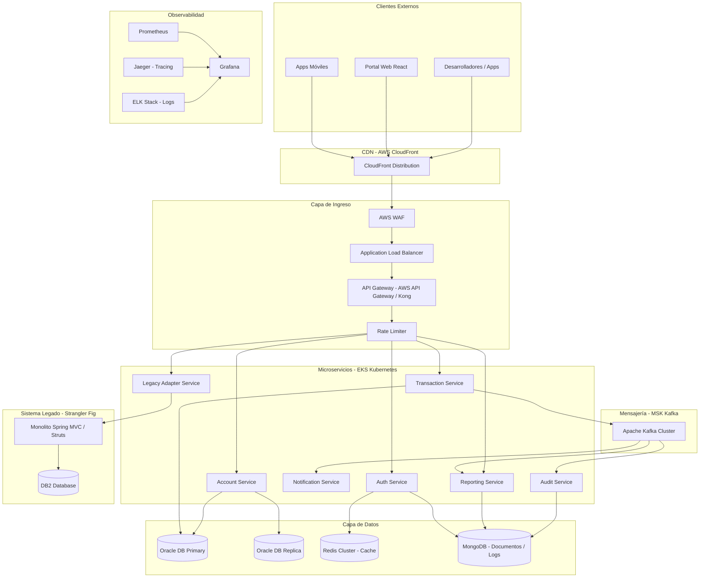
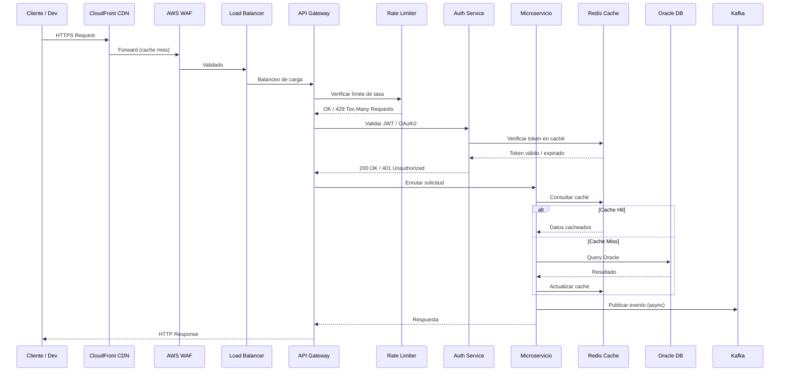
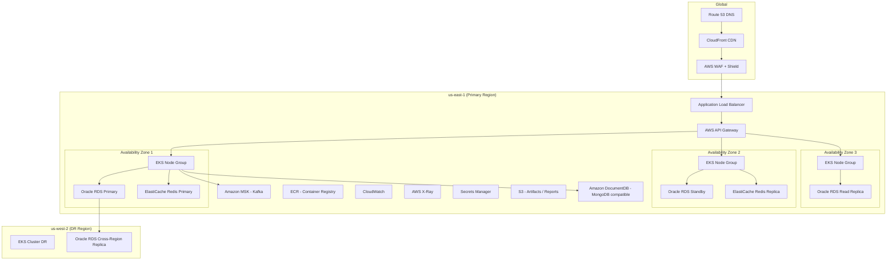
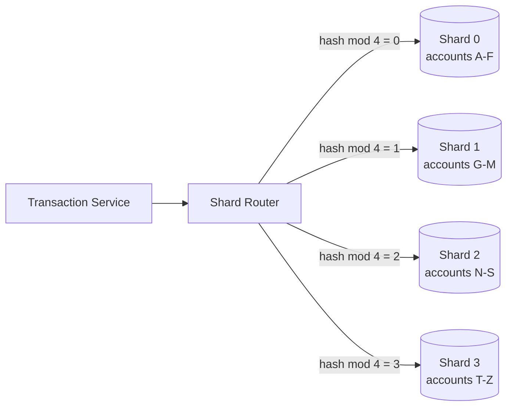
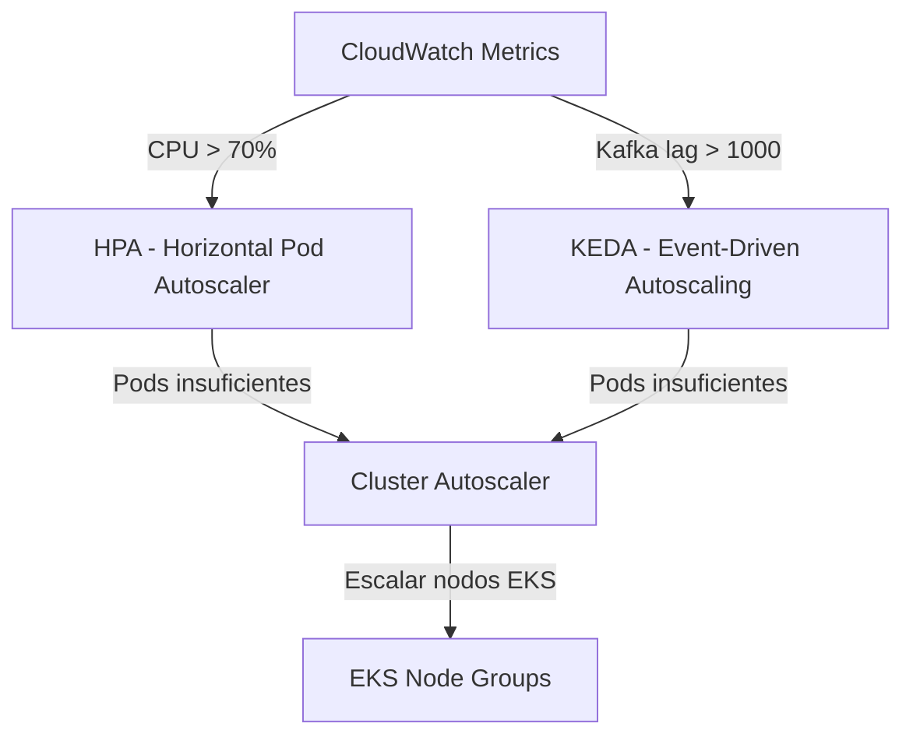
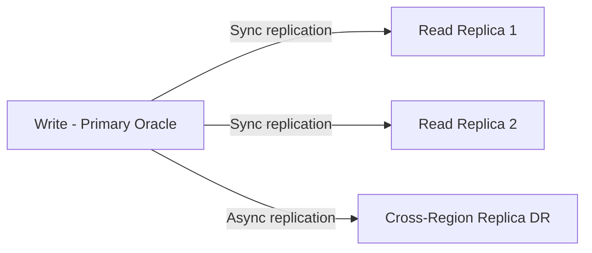

# Documento de Diseño: Migración de Plataforma Bancaria a Microservicios

## Descripción General

La plataforma bancaria actual es un monolito desarrollado en Spring MVC / Struts con Java 8, desplegado en WebLogic con base de datos DB2. Este documento describe la migración completa hacia una arquitectura de microservicios moderna sobre AWS, utilizando Spring Boot 3, Java 21, Kafka, Oracle Database, Redis, Docker y Kubernetes. El objetivo es soportar escalabilidad de 0 a 5 millones de usuarios con alta disponibilidad, resiliencia y observabilidad de nivel enterprise.

La estrategia de migración sigue el patrón **Strangler Fig**: los microservicios nuevos reemplazan gradualmente módulos del monolito, con un API Gateway como punto de entrada unificado que enruta tráfico entre el sistema legado y los nuevos servicios hasta la migración completa.

La plataforma expone APIs a desarrolladores externos alrededor del mundo, por lo que la consistencia de contratos, versionado de APIs, rate limiting y seguridad son requisitos de primer nivel.


---

## Arquitectura de Alto Nivel

### Diagrama General del Sistema




### Diagrama de Flujo de Solicitud (Request Flow)




---

## Componentes e Interfaces

### 1. API Gateway (AWS API Gateway + Kong)

**Propósito**: Punto de entrada único para todos los clientes externos. Gestiona autenticación, enrutamiento, transformación de requests y versionado de APIs.

**Responsabilidades**:
- Enrutamiento a microservicios por path/versión (`/v1/accounts`, `/v2/transactions`)
- Integración con Rate Limiter
- Transformación de headers y payloads
- Soporte para Canary Deployments durante la migración Strangler Fig
- Enrutamiento al Legacy Adapter para módulos aún no migrados

**Interfaz de configuración de rutas**:
```java
interface ApiGatewayRoute {
    String path();           // e.g. "/v1/accounts/**"
    String serviceTarget();  // e.g. "account-service:8080"
    boolean requiresAuth();
    RateLimitPolicy rateLimitPolicy();
    boolean legacyFallback(); // true durante migración Strangler Fig
}
```

---

### 2. Auth Service

**Propósito**: Autenticación y autorización centralizada con OAuth2 / JWT. Gestiona sesiones de desarrolladores externos y usuarios internos.

**Interfaz**:
```java
interface AuthService {
    TokenResponse authenticate(AuthRequest request);
    TokenValidationResult validateToken(String jwtToken);
    void revokeToken(String jwtToken);
    RefreshTokenResponse refreshToken(String refreshToken);
}
```

**Dependencias**: Redis (caché de tokens), MongoDB (audit log de sesiones)

---

### 3. Account Service

**Propósito**: Gestión del ciclo de vida de cuentas bancarias (creación, consulta, actualización, cierre).

**Interfaz**:
```java
interface AccountService {
    Account createAccount(CreateAccountRequest request);
    Account getAccount(String accountId);
    List<Account> getAccountsByCustomer(String customerId);
    Account updateAccount(String accountId, UpdateAccountRequest request);
    void closeAccount(String accountId);
    AccountBalance getBalance(String accountId);
}
```

**Dependencias**: Oracle DB (primario + réplica de lectura), Redis (caché de saldos), Kafka (eventos de cuenta)

---

### 4. Transaction Service

**Propósito**: Procesamiento de transacciones financieras con garantías ACID, manejo de concurrencia con Virtual Threads (Java 21) y publicación de eventos a Kafka.

**Interfaz**:
```java
interface TransactionService {
    TransactionResult processTransaction(TransactionRequest request);
    Transaction getTransaction(String transactionId);
    List<Transaction> getTransactionHistory(String accountId, DateRange range);
    TransactionResult reverseTransaction(String transactionId, String reason);
}
```

**Dependencias**: Oracle DB (escritura con sharding), Kafka (eventos), Redis (idempotency keys)

---

### 5. Notification Service

**Propósito**: Envío de notificaciones (email, SMS, push) de forma asíncrona consumiendo eventos de Kafka.

**Interfaz**:
```java
interface NotificationService {
    void sendNotification(NotificationRequest request);
    NotificationStatus getStatus(String notificationId);
}
```

**Dependencias**: Kafka (consumer), MongoDB (historial de notificaciones), AWS SES / SNS

---

### 6. Audit Service

**Propósito**: Registro inmutable de todas las operaciones del sistema para cumplimiento regulatorio.

**Interfaz**:
```java
interface AuditService {
    void recordEvent(AuditEvent event);
    List<AuditEvent> queryEvents(AuditQuery query);
}
```

**Dependencias**: Kafka (consumer), MongoDB (almacenamiento append-only)

---

### 7. Legacy Adapter Service

**Propósito**: Proxy hacia el monolito legado durante la migración Strangler Fig. Traduce contratos REST modernos a llamadas Struts/Servlet del monolito.

**Interfaz**:
```java
interface LegacyAdapterService {
    ResponseEntity<Object> forwardRequest(HttpServletRequest request, String legacyPath);
    boolean isModuleMigrated(String moduleName);
}
```


---

## Modelos de Datos

### Account (Oracle DB)

```java
@Entity
@Table(name = "ACCOUNTS")
public class Account {
    String accountId;       // UUID, PK
    String customerId;      // FK a CUSTOMERS
    AccountType type;       // CHECKING, SAVINGS, CREDIT
    AccountStatus status;   // ACTIVE, SUSPENDED, CLOSED
    BigDecimal balance;     // Saldo actual
    String currency;        // ISO 4217 (USD, EUR, etc.)
    LocalDateTime createdAt;
    LocalDateTime updatedAt;
    int shardKey;           // Para sharding por customerId hash
}
```

**Reglas de validación**:
- `balance >= 0` para cuentas CHECKING/SAVINGS
- `currency` debe ser código ISO 4217 válido
- `accountId` es inmutable tras creación

---

### Transaction (Oracle DB - Sharded)

```java
@Entity
@Table(name = "TRANSACTIONS")
public class Transaction {
    String transactionId;       // UUID, PK
    String sourceAccountId;     // FK a ACCOUNTS
    String targetAccountId;     // FK a ACCOUNTS (nullable para depósitos externos)
    BigDecimal amount;          // Siempre positivo
    TransactionType type;       // TRANSFER, DEPOSIT, WITHDRAWAL, REVERSAL
    TransactionStatus status;   // PENDING, COMPLETED, FAILED, REVERSED
    String idempotencyKey;      // Para deduplicación (unique constraint)
    String correlationId;       // Para trazabilidad distribuida
    LocalDateTime processedAt;
    int shardKey;               // Hash de sourceAccountId
}
```

---

### AuditEvent (MongoDB)

```java
public class AuditEvent {
    String eventId;         // UUID
    String correlationId;   // Trazabilidad cross-service
    String serviceOrigin;   // Nombre del microservicio
    String action;          // CREATE_ACCOUNT, PROCESS_TRANSACTION, etc.
    String actorId;         // userId o serviceId
    String resourceId;      // ID del recurso afectado
    Object payload;         // Snapshot del estado (JSON flexible)
    String ipAddress;
    LocalDateTime timestamp;
    boolean immutable = true; // Nunca se actualiza, solo insert
}
```

---

### TokenCache (Redis)

```
Key:   "auth:token:{jwtHash}"
Value: { userId, roles, expiresAt, deviceId }
TTL:   Igual al tiempo de expiración del JWT (típicamente 15 min)

Key:   "auth:refresh:{refreshTokenHash}"
Value: { userId, sessionId }
TTL:   7 días

Key:   "account:balance:{accountId}"
Value: { balance, currency, lastUpdated }
TTL:   30 segundos (consistencia eventual aceptable para lectura)
```


---

## Infraestructura AWS

### Diagrama de Infraestructura




### Componentes AWS Clave

| Componente | Servicio AWS | Propósito |
|---|---|---|
| CDN | CloudFront | Distribución global, caché de respuestas estáticas y API |
| DNS | Route 53 | Resolución DNS con health checks y failover automático |
| WAF | AWS WAF + Shield | Protección DDoS, reglas OWASP, IP filtering |
| Load Balancer | ALB (Application LB) | Balanceo L7, SSL termination, sticky sessions |
| API Gateway | AWS API Gateway | Gestión de APIs, throttling, autenticación |
| Contenedores | EKS (Kubernetes) | Orquestación de microservicios con autoscaling |
| Base Relacional | RDS Oracle | Datos transaccionales con Multi-AZ y réplicas |
| Cache | ElastiCache Redis | Caché distribuido, sesiones, rate limiting |
| Mensajería | Amazon MSK | Kafka gestionado para eventos asíncronos |
| NoSQL | Amazon DocumentDB | Logs de auditoría, documentos flexibles |
| Secretos | Secrets Manager | Credenciales, API keys, certificados |
| Observabilidad | CloudWatch + X-Ray | Métricas, logs, trazas distribuidas |
| Registry | ECR | Repositorio de imágenes Docker |
| Almacenamiento | S3 | Reportes, backups, artefactos de CI/CD |


---

## Patrones de System Design

### Sharding de Base de Datos

El Transaction Service utiliza sharding horizontal en Oracle para distribuir la carga de escritura. La clave de shard se calcula como `hash(sourceAccountId) % NUM_SHARDS`.



### Autoscaling (0 a 5 millones de usuarios)



**Niveles de escala**:
- 0–10K usuarios: 2 réplicas por servicio, 3 nodos EKS
- 10K–100K usuarios: HPA activa, 5–10 réplicas, 10 nodos
- 100K–1M usuarios: KEDA activa para Kafka consumers, 20+ nodos
- 1M–5M usuarios: Multi-region activo, read replicas Oracle, Redis cluster mode

### Rate Limiting

Implementado en dos capas:
1. **AWS API Gateway**: Throttling por API key (requests/segundo, burst)
2. **Redis Token Bucket**: Rate limiting por IP y por usuario con ventana deslizante

```
Key Redis: "ratelimit:{clientId}:{windowStart}"
Value:     contador de requests en la ventana
TTL:       duración de la ventana (60 segundos)
Algoritmo: Token Bucket con Redis INCR + EXPIRE atómico via Lua script
```

### Database Replication



- Escrituras siempre al nodo primario
- Lecturas de saldo y consultas históricas a réplicas de lectura
- Réplica cross-region para Disaster Recovery (RPO < 1 minuto)


---

## Diseño de Bajo Nivel

### Algoritmo Principal: Procesamiento de Transacciones con Virtual Threads (Java 21)

```java
// TransactionService.java - Java 21 con Virtual Threads (Project Loom)

@Service
public class TransactionService {

    // Executor de Virtual Threads para concurrencia masiva sin bloqueo de platform threads
    private final ExecutorService virtualThreadExecutor =
        Executors.newVirtualThreadPerTaskExecutor();

    /**
     * Procesa una transacción financiera con garantías ACID.
     *
     * Precondiciones:
     *   - request != null y todos los campos requeridos presentes
     *   - sourceAccountId existe y está ACTIVE
     *   - amount > 0
     *   - idempotencyKey es único (no procesado previamente)
     *
     * Postcondiciones:
     *   - Si exitoso: saldo de sourceAccount decrementado, targetAccount incrementado
     *   - Evento TransactionCompleted publicado en Kafka
     *   - AuditEvent registrado
     *   - Si falla: rollback completo, ningún saldo modificado
     *   - idempotencyKey marcado como procesado (éxito o fallo)
     *
     * Invariante de loop: No aplica (operación atómica)
     * Complejidad: O(1) para la transacción, O(log n) para lookup de shard
     */
    public CompletableFuture<TransactionResult> processTransaction(TransactionRequest request) {
        return CompletableFuture.supplyAsync(() -> {
            // 1. Verificar idempotencia (evitar doble procesamiento)
            if (idempotencyStore.exists(request.idempotencyKey())) {
                return idempotencyStore.getResult(request.idempotencyKey());
            }

            // 2. Validar y adquirir locks distribuidos (Redis SETNX)
            String lockKey = "txn:lock:" + request.sourceAccountId();
            try (DistributedLock lock = redisLockManager.acquire(lockKey, Duration.ofSeconds(5))) {

                // 3. Verificar saldo suficiente (lectura del primario para consistencia)
                Account source = accountRepository.findByIdForUpdate(request.sourceAccountId());
                validateSufficientBalance(source, request.amount());

                // 4. Ejecutar transferencia en transacción DB
                TransactionResult result = executeInTransaction(() -> {
                    debitAccount(source, request.amount());
                    creditAccount(request.targetAccountId(), request.amount());
                    Transaction txn = persistTransaction(request, TransactionStatus.COMPLETED);
                    return TransactionResult.success(txn);
                });

                // 5. Publicar evento a Kafka (async, no bloquea respuesta)
                kafkaProducer.publishAsync("transactions.completed",
                    new TransactionCompletedEvent(result.transactionId(), request));

                // 6. Invalidar caché de saldo
                redisCache.delete("account:balance:" + request.sourceAccountId());
                redisCache.delete("account:balance:" + request.targetAccountId());

                // 7. Registrar idempotency key
                idempotencyStore.store(request.idempotencyKey(), result, Duration.ofHours(24));

                return result;
            }
        }, virtualThreadExecutor);
    }
}
```

---

### Algoritmo: Rate Limiting con Redis (Token Bucket via Lua)

```java
/**
 * RateLimiter.java
 *
 * Precondiciones:
 *   - clientId != null
 *   - maxRequests > 0
 *   - windowSeconds > 0
 *
 * Postcondiciones:
 *   - Si allowed=true: contador incrementado en Redis
 *   - Si allowed=false: contador NO modificado, retryAfter calculado
 *   - Atomicidad garantizada por script Lua en Redis
 */
@Component
public class RedisRateLimiter {

    // Script Lua para atomicidad: INCR + EXPIRE en una sola operación
    private static final String RATE_LIMIT_SCRIPT = """
        local key = KEYS[1]
        local limit = tonumber(ARGV[1])
        local window = tonumber(ARGV[2])
        local current = redis.call('INCR', key)
        if current == 1 then
            redis.call('EXPIRE', key, window)
        end
        if current > limit then
            return {0, redis.call('TTL', key)}
        end
        return {1, 0}
        """;

    public RateLimitResult checkLimit(String clientId, int maxRequests, int windowSeconds) {
        String key = "ratelimit:" + clientId + ":" + (System.currentTimeMillis() / (windowSeconds * 1000L));
        List<Long> result = redisTemplate.execute(
            RedisScript.of(RATE_LIMIT_SCRIPT, List.class),
            List.of(key),
            String.valueOf(maxRequests),
            String.valueOf(windowSeconds)
        );
        boolean allowed = result.get(0) == 1L;
        long retryAfterSeconds = result.get(1);
        return new RateLimitResult(allowed, retryAfterSeconds);
    }
}
```


---

### Algoritmo: Shard Router para Oracle DB

```java
/**
 * ShardRouter.java
 *
 * Precondiciones:
 *   - accountId != null y no vacío
 *   - NUM_SHARDS > 0 y configurado
 *
 * Postcondiciones:
 *   - Retorna siempre el mismo DataSource para el mismo accountId (determinístico)
 *   - La distribución es uniforme: |shard_i_size - shard_j_size| <= 1 para distribución ideal
 *
 * Invariante: hash(accountId) % NUM_SHARDS es estable para el mismo accountId
 */
@Component
public class ShardRouter {

    private static final int NUM_SHARDS = 4;
    private final Map<Integer, DataSource> shardDataSources;

    public DataSource resolveDataSource(String accountId) {
        int shardIndex = Math.abs(accountId.hashCode()) % NUM_SHARDS;
        return shardDataSources.get(shardIndex);
    }

    public int getShardKey(String accountId) {
        return Math.abs(accountId.hashCode()) % NUM_SHARDS;
    }
}
```

---

### Algoritmo: Strangler Fig - Enrutamiento Progresivo

```java
/**
 * LegacyAdapterService.java
 *
 * Implementa el patrón Strangler Fig: enruta al nuevo microservicio si está migrado,
 * o al monolito legado si no.
 *
 * Precondiciones:
 *   - moduleName != null
 *   - featureFlags cargados desde AWS AppConfig
 *
 * Postcondiciones:
 *   - Si módulo migrado: request procesado por microservicio nuevo
 *   - Si módulo no migrado: request forwarded al monolito (WebLogic endpoint)
 *   - Ambos caminos retornan el mismo contrato de respuesta
 */
@Service
public class LegacyAdapterService {

    public ResponseEntity<Object> routeRequest(String moduleName, HttpServletRequest request) {
        if (featureFlagService.isModuleMigrated(moduleName)) {
            // Enrutar al nuevo microservicio via service discovery
            String serviceUrl = serviceRegistry.resolve(moduleName);
            return httpClient.forward(serviceUrl, request);
        } else {
            // Enrutar al monolito legado
            String legacyUrl = legacyConfig.getWebLogicUrl() + "/legacy/" + moduleName;
            return legacyHttpClient.forward(legacyUrl, request);
        }
    }
}
```

---

### Algoritmo: Autenticación OAuth2 con JWT y Virtual Threads

```java
/**
 * AuthService.java
 *
 * Precondiciones:
 *   - credentials.username != null y no vacío
 *   - credentials.password != null y no vacío
 *
 * Postcondiciones:
 *   - Si válido: retorna TokenResponse con accessToken (15 min) y refreshToken (7 días)
 *   - accessToken almacenado en Redis con TTL
 *   - AuditEvent LOGIN_SUCCESS publicado
 *   - Si inválido: lanza AuthenticationException, AuditEvent LOGIN_FAILED publicado
 *   - Máximo 5 intentos fallidos antes de bloqueo temporal (15 min)
 */
@Service
public class AuthService {

    public TokenResponse authenticate(AuthRequest credentials) {
        // Verificar intentos fallidos (Redis counter)
        String failKey = "auth:fails:" + credentials.username();
        int failCount = redisTemplate.opsForValue().get(failKey, Integer.class).orElse(0);
        if (failCount >= 5) {
            throw new AccountLockedException("Cuenta bloqueada temporalmente");
        }

        // Buscar usuario (Virtual Thread permite I/O bloqueante sin desperdiciar platform threads)
        User user = userRepository.findByUsername(credentials.username())
            .orElseThrow(() -> new AuthenticationException("Credenciales inválidas"));

        // Verificar password con BCrypt
        if (!passwordEncoder.matches(credentials.password(), user.passwordHash())) {
            redisTemplate.opsForValue().increment(failKey);
            redisTemplate.expire(failKey, Duration.ofMinutes(15));
            auditService.record(AuditEvent.loginFailed(credentials.username()));
            throw new AuthenticationException("Credenciales inválidas");
        }

        // Generar tokens
        String accessToken = jwtService.generateAccessToken(user);
        String refreshToken = jwtService.generateRefreshToken(user);

        // Cachear en Redis
        redisTemplate.opsForValue().set(
            "auth:token:" + jwtService.hash(accessToken),
            new TokenCacheEntry(user.id(), user.roles()),
            Duration.ofMinutes(15)
        );

        // Limpiar contador de fallos
        redisTemplate.delete(failKey);
        auditService.record(AuditEvent.loginSuccess(user.id()));

        return new TokenResponse(accessToken, refreshToken, 900);
    }
}
```


---

### Concurrencia con Java 21 - Virtual Threads (Project Loom)

```java
/**
 * Configuración de Virtual Threads para Spring Boot 3 + WebFlux
 *
 * Virtual Threads permiten manejar miles de conexiones concurrentes sin el overhead
 * de platform threads. Ideal para operaciones I/O-bound como llamadas a DB, Redis y Kafka.
 *
 * Precondición: Java 21+ requerido
 * Postcondición: Cada request HTTP se ejecuta en un Virtual Thread independiente
 */
@Configuration
public class VirtualThreadConfig {

    // Habilitar Virtual Threads para el servidor embebido (Tomcat/Netty)
    @Bean
    public TomcatProtocolHandlerCustomizer<?> virtualThreadsProtocolHandlerCustomizer() {
        return protocolHandler ->
            protocolHandler.setExecutor(Executors.newVirtualThreadPerTaskExecutor());
    }

    // Executor para tareas asíncronas del servicio
    @Bean("virtualThreadExecutor")
    public ExecutorService virtualThreadExecutor() {
        return Executors.newVirtualThreadPerTaskExecutor();
    }
}

/**
 * Ejemplo de uso: Procesamiento paralelo de múltiples cuentas con Virtual Threads
 *
 * Precondiciones:
 *   - accountIds es lista no vacía
 *   - Cada accountId existe en la base de datos
 *
 * Postcondiciones:
 *   - Retorna lista de saldos en el mismo orden que accountIds
 *   - Todas las consultas ejecutadas en paralelo (no secuencial)
 *   - Tiempo total ≈ max(tiempo_individual) en lugar de sum(tiempos)
 *
 * Invariante de loop: Cada tarea es independiente, sin estado compartido mutable
 */
public List<AccountBalance> getBalancesBatch(List<String> accountIds) {
    try (var scope = new StructuredTaskScope.ShutdownOnFailure()) {
        List<StructuredTaskScope.Subtask<AccountBalance>> tasks = accountIds.stream()
            .map(id -> scope.fork(() -> accountRepository.getBalance(id)))
            .toList();

        scope.join().throwIfFailed();

        return tasks.stream()
            .map(StructuredTaskScope.Subtask::get)
            .toList();
    }
}
```

---

### Configuración Kubernetes - Autoscaling

```yaml
# transaction-service-hpa.yaml
apiVersion: autoscaling/v2
kind: HorizontalPodAutoscaler
metadata:
  name: transaction-service-hpa
spec:
  scaleTargetRef:
    apiVersion: apps/v1
    kind: Deployment
    name: transaction-service
  minReplicas: 2
  maxReplicas: 50
  metrics:
    - type: Resource
      resource:
        name: cpu
        target:
          type: Utilization
          averageUtilization: 70
    - type: External
      external:
        metric:
          name: kafka_consumer_lag
          selector:
            matchLabels:
              topic: transactions.pending
        target:
          type: AverageValue
          averageValue: "1000"
---
# KEDA ScaledObject para Kafka-driven autoscaling
apiVersion: keda.sh/v1alpha1
kind: ScaledObject
metadata:
  name: transaction-service-keda
spec:
  scaleTargetRef:
    name: transaction-service
  minReplicaCount: 0
  maxReplicaCount: 100
  triggers:
    - type: kafka
      metadata:
        bootstrapServers: msk-cluster:9092
        consumerGroup: transaction-processors
        topic: transactions.pending
        lagThreshold: "500"
```


---

## Manejo de Errores

### Escenario 1: Fallo en Transacción (Saldo Insuficiente)

**Condición**: `account.balance < request.amount`
**Respuesta**: HTTP 422 Unprocessable Entity con código `INSUFFICIENT_FUNDS`
**Recuperación**: No se modifica ningún saldo. idempotencyKey marcado como FAILED.

### Escenario 2: Timeout en Base de Datos

**Condición**: Oracle no responde en < 3 segundos
**Respuesta**: HTTP 503 Service Unavailable con `Retry-After: 5`
**Recuperación**: Circuit Breaker (Resilience4j) abre el circuito tras 5 fallos consecutivos. Fallback a réplica de lectura para consultas. Alertas a CloudWatch.

### Escenario 3: Partición de Red en Kafka

**Condición**: MSK Kafka no disponible al publicar evento
**Respuesta**: Transacción DB se completa (ACID garantizado). Evento se almacena en tabla `OUTBOX` de Oracle.
**Recuperación**: Outbox Pattern: proceso periódico reintenta publicar eventos pendientes de la tabla OUTBOX.

### Escenario 4: Módulo Legado No Disponible

**Condición**: WebLogic monolito no responde
**Respuesta**: HTTP 503 con mensaje descriptivo
**Recuperación**: Circuit Breaker en LegacyAdapterService. Si el módulo tiene versión migrada parcial, se activa feature flag para usar el nuevo servicio.

### Escenario 5: Expiración de Token JWT

**Condición**: Token expirado (TTL Redis vencido o `exp` claim pasado)
**Respuesta**: HTTP 401 con `WWW-Authenticate: Bearer error="token_expired"`
**Recuperación**: Cliente usa refreshToken para obtener nuevo accessToken sin re-autenticación.

---

## Estrategia de Testing

### Testing Unitario

- JUnit 5 + Mockito para cada microservicio
- Cobertura mínima: 80% de líneas en lógica de negocio
- Tests de algoritmos de sharding, rate limiting y validación de transacciones

### Testing Basado en Propiedades

**Librería**: jqwik (Java property-based testing)

**Propiedades clave a verificar**:
- Para cualquier transacción válida: `balance_antes - amount == balance_después`
- Para cualquier accountId: `shardRouter.resolve(id)` siempre retorna el mismo shard
- Para cualquier clientId: rate limiter nunca permite más de `maxRequests` en la ventana
- Para cualquier JWT válido: `validateToken(generateToken(user)).userId == user.id`

### Testing de Integración

- Testcontainers para Oracle, Redis y Kafka en tests de integración
- Tests de contrato con Spring Cloud Contract entre microservicios
- Tests de carga con Gatling: simular 100K requests/minuto

### Testing de Migración (Strangler Fig)

- Shadow mode: duplicar tráfico al nuevo servicio y comparar respuestas con el legado
- Canary deployment: 5% → 25% → 50% → 100% del tráfico al nuevo servicio
- Rollback automático si error rate > 1% en el nuevo servicio

---

## Consideraciones de Rendimiento

- **Virtual Threads**: Soportan 100K+ conexiones concurrentes con footprint mínimo de memoria vs. platform threads
- **Redis Cache**: Reduce carga en Oracle ~70% para lecturas de saldo (TTL 30s)
- **Read Replicas**: Consultas históricas y reportes van a réplicas, liberando el primario para escrituras
- **Kafka Async**: Notificaciones y auditoría son asíncronas, no bloquean el path crítico de transacciones
- **CloudFront CDN**: Cachea respuestas de APIs de solo lectura (catálogos, configuraciones) con TTL configurable
- **Connection Pooling**: HikariCP configurado con pool size = `(núcleos_CPU * 2) + spindle_count` por servicio

---

## Consideraciones de Seguridad

- **mTLS** entre microservicios dentro del cluster EKS (Istio service mesh)
- **OAuth2 + JWT** para autenticación de desarrolladores externos (RS256, rotación de claves cada 90 días)
- **AWS Secrets Manager** para todas las credenciales (nunca en variables de entorno o código)
- **WAF Rules**: OWASP Top 10, SQL injection, XSS, rate limiting por IP
- **Encryption at rest**: Oracle TDE, Redis encryption, S3 SSE-KMS
- **Encryption in transit**: TLS 1.3 en todos los endpoints
- **PCI DSS**: Datos de tarjetas nunca almacenados en texto plano (tokenización con AWS Payment Cryptography)
- **Audit Trail**: Todos los accesos a datos sensibles registrados en MongoDB (inmutable, retención 7 años)

---

## Dependencias

| Dependencia | Versión | Propósito |
|---|---|---|
| Spring Boot | 3.2+ | Framework base de microservicios |
| Spring WebFlux | 6.1+ | Programación reactiva (opcional junto a Virtual Threads) |
| Java | 21 LTS | Virtual Threads, Records, Pattern Matching |
| Kafka Client | 3.6+ | Mensajería asíncrona |
| Resilience4j | 2.1+ | Circuit Breaker, Retry, Rate Limiter |
| Micrometer | 1.12+ | Métricas para Prometheus |
| Testcontainers | 1.19+ | Tests de integración con contenedores |
| jqwik | 1.8+ | Property-based testing |
| Gatling | 3.10+ | Tests de carga |
| Helm | 3.x | Packaging de charts Kubernetes |
| Terraform | 1.6+ | Infraestructura AWS como código |


---

## Propiedades de Corrección

*Una propiedad es una característica o comportamiento que debe mantenerse verdadero en todas las ejecuciones válidas del sistema — esencialmente, una declaración formal sobre lo que el sistema debe hacer. Las propiedades sirven como puente entre las especificaciones legibles por humanos y las garantías de corrección verificables por máquinas.*

### Propiedad 1: Conservación de saldo en transacciones

*Para toda* transacción completada con monto A entre cuenta origen S y cuenta destino D, el saldo de S debe decrementarse exactamente en A y el saldo de D debe incrementarse exactamente en A: `balance(S)_post = balance(S)_pre - A` y `balance(D)_post = balance(D)_pre + A`.

**Valida: Requisitos 4.2**

---

### Propiedad 2: Idempotencia de transacciones

*Para toda* clave de idempotencia K, ejecutar `processTransaction(K)` N veces (N ≥ 1) produce exactamente el mismo resultado que ejecutarlo 1 vez, y los saldos de las cuentas involucradas no cambian tras la primera ejecución exitosa.

**Valida: Requisitos 4.1**

---

### Propiedad 3: Rechazo de transacciones con saldo insuficiente

*Para toda* solicitud de transacción donde el monto supera el saldo disponible de la cuenta origen, la operación debe ser rechazada y los saldos de ambas cuentas deben permanecer sin cambios.

**Valida: Requisitos 4.3**

---

### Propiedad 4: Reversión restaura saldos originales (round-trip)

*Para toda* transacción completada T, aplicar una reversión debe restaurar los saldos de las cuentas origen y destino a sus valores previos a T, de forma atómica.

**Valida: Requisitos 4.7**

---

### Propiedad 5: Determinismo de sharding

*Para todo* `accountId`, `shardRouter.getShardKey(accountId)` retorna siempre el mismo valor independientemente del número de invocaciones o del estado del sistema.

**Valida: Requisitos 4.10**

---

### Propiedad 6: Rate limiting estricto

*Para todo* cliente C en cualquier ventana de tiempo W, el número de solicitudes permitidas por el Rate_Limiter nunca excede `maxRequests(C)`, independientemente de la concurrencia o el orden de llegada de las solicitudes.

**Valida: Requisitos 8.4**

---

### Propiedad 7: Inmutabilidad de auditoría

*Para todo* `AuditEvent` persistido en MongoDB, ninguna operación posterior puede modificar o eliminar ese registro; el sistema debe rechazar cualquier intento de actualización o borrado.

**Valida: Requisitos 6.3**

---

### Propiedad 8: Completitud de campos en AuditEvents

*Para todo* evento de auditoría generado por cualquier operación del sistema (autenticación, acceso a datos sensibles, transacciones), el `AuditEvent` persistido debe contener todos los campos requeridos: `eventId`, `correlationId`, `serviceOrigin`, `action`, `actorId`, `resourceId`, `payload`, `ipAddress` y `timestamp`.

**Valida: Requisitos 6.2, 12.8, 2.8**

---

### Propiedad 9: Autenticación sin bypass

*Para toda* solicitud a un endpoint protegido con JWT inválido, expirado o ausente, el sistema debe retornar HTTP 401 sin procesar la solicitud ni exponer datos del recurso solicitado.

**Valida: Requisitos 1.5, 2.7**

---

### Propiedad 10: Round-trip de autenticación con refresh token

*Para todo* usuario válido, el flujo `authenticate → obtener refreshToken → usar refreshToken → obtener nuevo accessToken` debe producir un accessToken válido que permita acceder a los recursos protegidos.

**Valida: Requisitos 2.1, 2.4**

---

### Propiedad 11: Revocación inmediata de tokens

*Para todo* JWT revocado, cualquier solicitud posterior que presente ese token debe ser rechazada con HTTP 401, sin importar si el token aún no ha expirado según su claim `exp`.

**Valida: Requisitos 2.6**

---

### Propiedad 12: Enrutamiento Strangler Fig — exclusión mutua y completitud

*Para toda* solicitud recibida durante la migración, exactamente uno de los dos sistemas (microservicio nuevo o Monolito legado) procesa la solicitud; ninguna solicitud es procesada por ambos simultáneamente ni por ninguno.

**Valida: Requisitos 7.1, 7.2, 7.4, 7.5, 1.2, 1.3**

---

### Propiedad 13: Invariante de saldo no negativo

*Para toda* cuenta de tipo CHECKING o SAVINGS, el saldo nunca debe ser negativo tras cualquier operación del sistema.

**Valida: Requisitos 3.5**

---

### Propiedad 14: Inmutabilidad del accountId

*Para todo* `accountId` asignado en la creación de una cuenta, ninguna operación posterior (actualización, cierre, consulta) debe modificar ese identificador.

**Valida: Requisitos 3.7**

---

### Propiedad 15: Validación de moneda ISO 4217

*Para todo* código de moneda proporcionado en la creación de una cuenta, si el código no es un código ISO 4217 válido, la operación debe ser rechazada con HTTP 400.

**Valida: Requisitos 3.6**

---

### Propiedad 16: Propagación de correlationId

*Para toda* solicitud que ingresa al sistema con un `correlationId`, ese identificador debe estar presente en los headers de todas las llamadas downstream entre microservicios y en todos los registros de auditoría y trazas generados por esa solicitud.

**Valida: Requisitos 1.7, 11.2**

---

### Propiedad 17: Publicación de eventos Kafka por transacción completada

*Para toda* transacción completada exitosamente, debe existir exactamente un evento `TransactionCompleted` publicado en el topic `transactions.completed` de Kafka (o almacenado en la tabla OUTBOX si Kafka no está disponible).

**Valida: Requisitos 4.4, 4.5**

---

### Propiedad 18: Procesamiento eventual de eventos OUTBOX

*Para todo* evento almacenado en la tabla OUTBOX, el Outbox_Processor debe eventualmente publicarlo en Kafka con éxito, garantizando que ningún evento queda pendiente indefinidamente.

**Valida: Requisitos 10.6**

---

### Propiedad 19: Rotación de claves JWT sin interrupción de sesiones

*Para todo* token JWT emitido antes de una rotación de claves de firma, ese token debe seguir siendo válido hasta su expiración natural, incluso después de que la nueva clave esté activa.

**Valida: Requisitos 12.7**

---

### Propiedad 20: Tokenización de datos de tarjetas

*Para todo* dato de tarjeta de pago procesado por el sistema, ninguna representación en texto plano del número de tarjeta debe aparecer en ningún almacenamiento persistente (Oracle DB, MongoDB, Redis, S3, logs).

**Valida: Requisitos 12.6**

