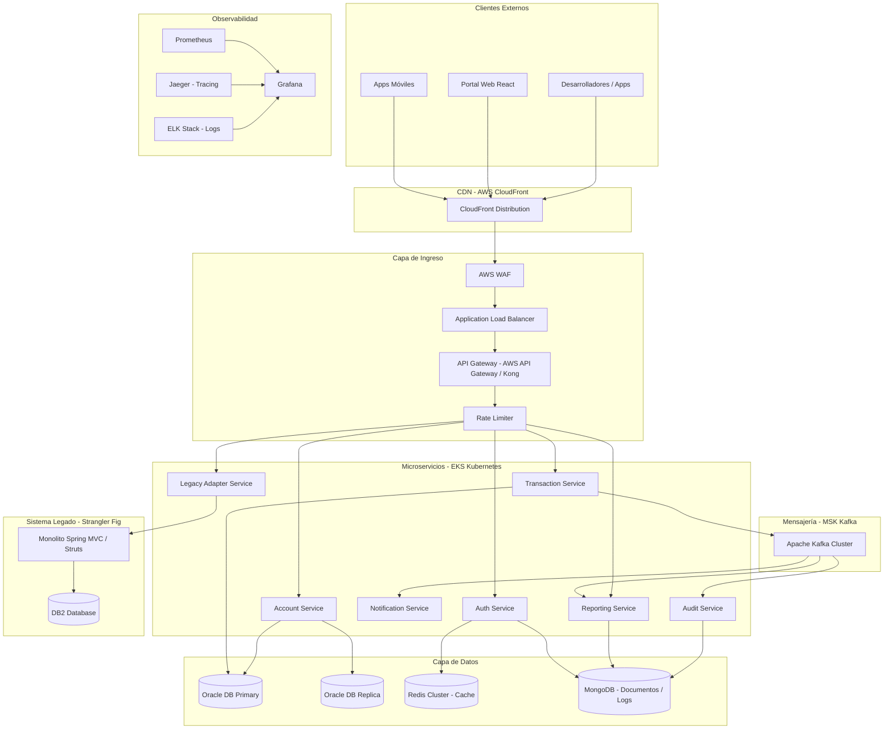
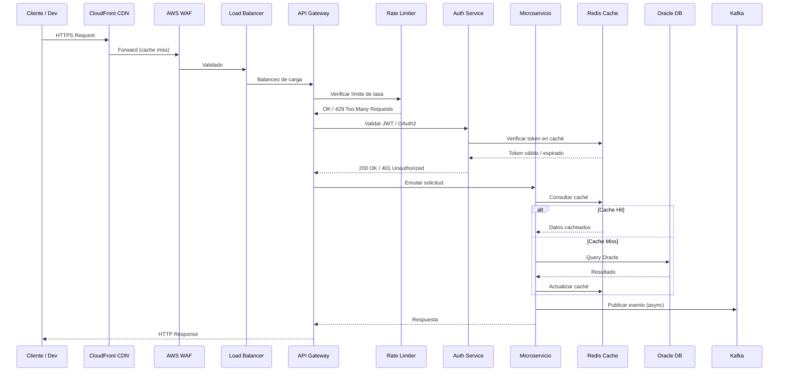
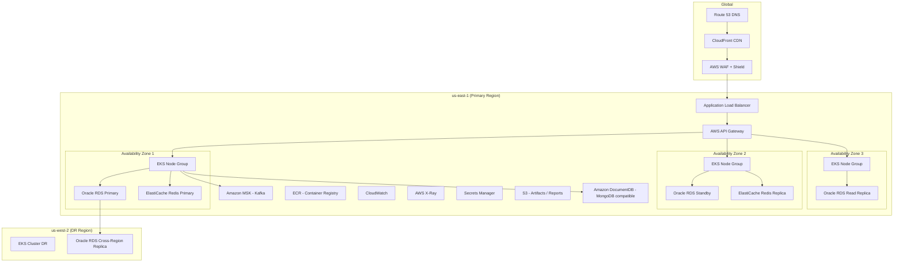
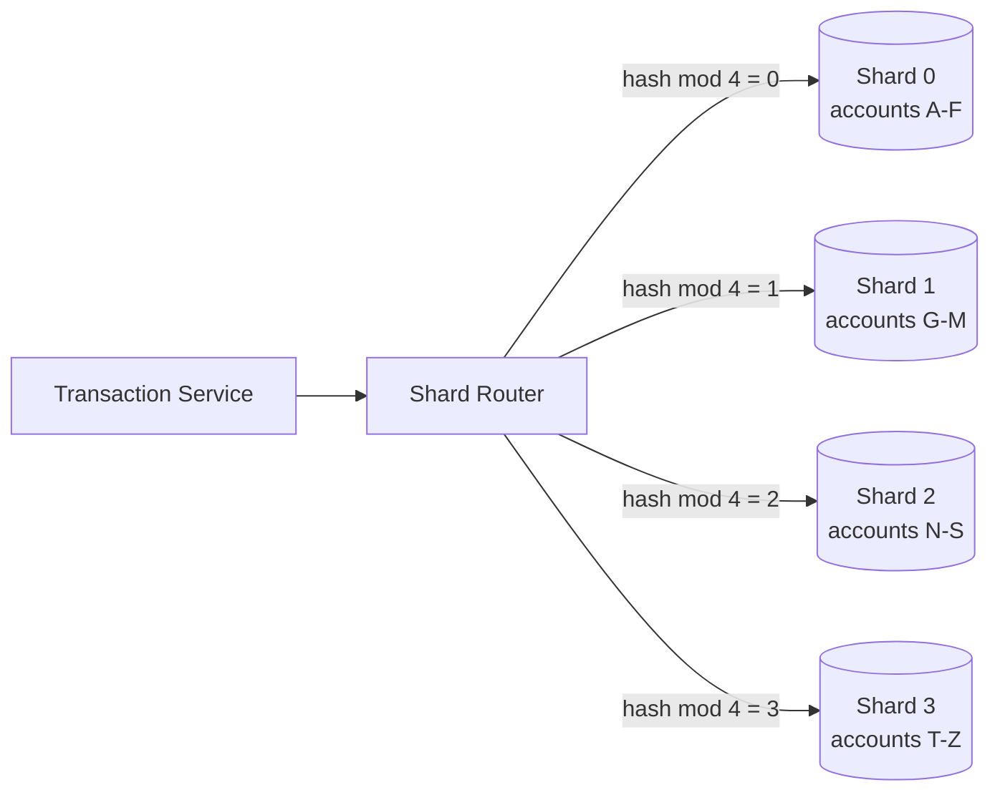
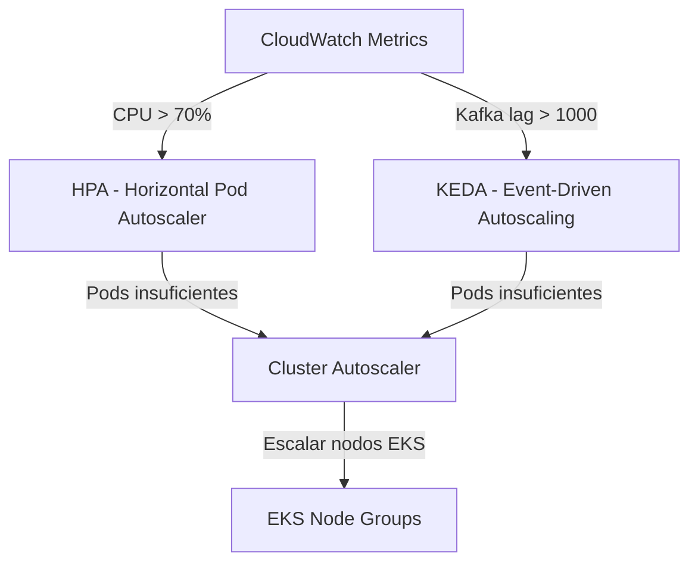
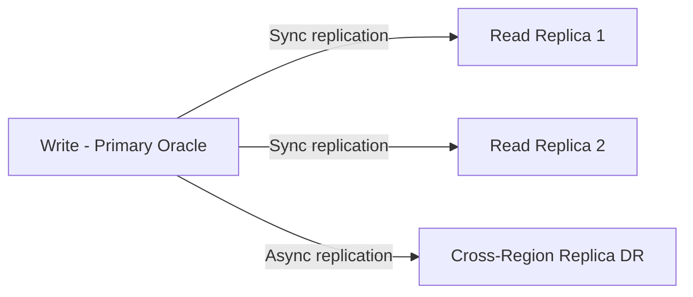

# Documento de Diseño: Migración de Plataforma Bancaria a Microservicios

## Descripción General

La plataforma bancaria actual es un monolito desarrollado en Spring MVC / Struts con Java 8, desplegado en WebLogic con base de datos DB2. Este documento describe la migración completa hacia una arquitectura de microservicios moderna sobre AWS, utilizando Spring Boot 3, Java 21, Kafka, Oracle Database, Redis, Docker y Kubernetes. El objetivo es soportar escalabilidad de 0 a 5 millones de usuarios con alta disponibilidad, resiliencia y observabilidad de nivel enterprise.

La estrategia de migración sigue el patrón **Strangler Fig**: los microservicios nuevos reemplazan gradualmente módulos del monolito, con un API Gateway como punto de entrada unificado que enruta tráfico entre el sistema legado y los nuevos servicios hasta la migración completa.

La plataforma expone APIs a desarrolladores externos alrededor del mundo, por lo que la consistencia de contratos, versionado de APIs, rate limiting y seguridad son requisitos de primer nivel.


---

## Arquitectura de Alto Nivel

### Diagrama General del Sistema




### Diagrama de Flujo de Solicitud (Request Flow)




---

## Componentes e Interfaces

### 1. API Gateway (AWS API Gateway + Kong)

**Propósito**: Punto de entrada único para todos los clientes externos. Gestiona autenticación, enrutamiento, transformación de requests y versionado de APIs.

**Responsabilidades**:
- Enrutamiento a microservicios por path/versión (`/v1/accounts`, `/v2/transactions`)
- Integración con Rate Limiter
- Transformación de headers y payloads
- Soporte para Canary Deployments durante la migración Strangler Fig
- Enrutamiento al Legacy Adapter para módulos aún no migrados

**Interfaz de configuración de rutas**:
```java
interface ApiGatewayRoute {
    String path();           // e.g. "/v1/accounts/**"
    String serviceTarget();  // e.g. "account-service:8080"
    boolean requiresAuth();
    RateLimitPolicy rateLimitPolicy();
    boolean legacyFallback(); // true durante migración Strangler Fig
}
```

---

### 2. Auth Service

**Propósito**: Autenticación y autorización centralizada con OAuth2 / JWT. Gestiona sesiones de desarrolladores externos y usuarios internos.

**Interfaz**:
```java
interface AuthService {
    TokenResponse authenticate(AuthRequest request);
    TokenValidationResult validateToken(String jwtToken);
    void revokeToken(String jwtToken);
    RefreshTokenResponse refreshToken(String refreshToken);
}
```

**Dependencias**: Redis (caché de tokens), MongoDB (audit log de sesiones)

---

### 3. Account Service

**Propósito**: Gestión del ciclo de vida de cuentas bancarias (creación, consulta, actualización, cierre).

**Interfaz**:
```java
interface AccountService {
    Account createAccount(CreateAccountRequest request);
    Account getAccount(String accountId);
    List<Account> getAccountsByCustomer(String customerId);
    Account updateAccount(String accountId, UpdateAccountRequest request);
    void closeAccount(String accountId);
    AccountBalance getBalance(String accountId);
}
```

**Dependencias**: Oracle DB (primario + réplica de lectura), Redis (caché de saldos), Kafka (eventos de cuenta)

---

### 4. Transaction Service

**Propósito**: Procesamiento de transacciones financieras con garantías ACID, manejo de concurrencia con Virtual Threads (Java 21) y publicación de eventos a Kafka.

**Interfaz**:
```java
interface TransactionService {
    TransactionResult processTransaction(TransactionRequest request);
    Transaction getTransaction(String transactionId);
    List<Transaction> getTransactionHistory(String accountId, DateRange range);
    TransactionResult reverseTransaction(String transactionId, String reason);
}
```

**Dependencias**: Oracle DB (escritura con sharding), Kafka (eventos), Redis (idempotency keys)

---

### 5. Notification Service

**Propósito**: Envío de notificaciones (email, SMS, push) de forma asíncrona consumiendo eventos de Kafka.

**Interfaz**:
```java
interface NotificationService {
    void sendNotification(NotificationRequest request);
    NotificationStatus getStatus(String notificationId);
}
```

**Dependencias**: Kafka (consumer), MongoDB (historial de notificaciones), AWS SES / SNS

---

### 6. Audit Service

**Propósito**: Registro inmutable de todas las operaciones del sistema para cumplimiento regulatorio.

**Interfaz**:
```java
interface AuditService {
    void recordEvent(AuditEvent event);
    List<AuditEvent> queryEvents(AuditQuery query);
}
```

**Dependencias**: Kafka (consumer), MongoDB (almacenamiento append-only)

---

### 7. Legacy Adapter Service

**Propósito**: Proxy hacia el monolito legado durante la migración Strangler Fig. Traduce contratos REST modernos a llamadas Struts/Servlet del monolito.

**Interfaz**:
```java
interface LegacyAdapterService {
    ResponseEntity<Object> forwardRequest(HttpServletRequest request, String legacyPath);
    boolean isModuleMigrated(String moduleName);
}
```


---

## Modelos de Datos

### Account (Oracle DB)

```java
@Entity
@Table(name = "ACCOUNTS")
public class Account {
    String accountId;       // UUID, PK
    String customerId;      // FK a CUSTOMERS
    AccountType type;       // CHECKING, SAVINGS, CREDIT
    AccountStatus status;   // ACTIVE, SUSPENDED, CLOSED
    BigDecimal balance;     // Saldo actual
    String currency;        // ISO 4217 (USD, EUR, etc.)
    LocalDateTime createdAt;
    LocalDateTime updatedAt;
    int shardKey;           // Para sharding por customerId hash
}
```

**Reglas de validación**:
- `balance >= 0` para cuentas CHECKING/SAVINGS
- `currency` debe ser código ISO 4217 válido
- `accountId` es inmutable tras creación

---

### Transaction (Oracle DB - Sharded)

```java
@Entity
@Table(name = "TRANSACTIONS")
public class Transaction {
    String transactionId;       // UUID, PK
    String sourceAccountId;     // FK a ACCOUNTS
    String targetAccountId;     // FK a ACCOUNTS (nullable para depósitos externos)
    BigDecimal amount;          // Siempre positivo
    TransactionType type;       // TRANSFER, DEPOSIT, WITHDRAWAL, REVERSAL
    TransactionStatus status;   // PENDING, COMPLETED, FAILED, REVERSED
    String idempotencyKey;      // Para deduplicación (unique constraint)
    String correlationId;       // Para trazabilidad distribuida
    LocalDateTime processedAt;
    int shardKey;               // Hash de sourceAccountId
}
```

---

### AuditEvent (MongoDB)

```java
public class AuditEvent {
    String eventId;         // UUID
    String correlationId;   // Trazabilidad cross-service
    String serviceOrigin;   // Nombre del microservicio
    String action;          // CREATE_ACCOUNT, PROCESS_TRANSACTION, etc.
    String actorId;         // userId o serviceId
    String resourceId;      // ID del recurso afectado
    Object payload;         // Snapshot del estado (JSON flexible)
    String ipAddress;
    LocalDateTime timestamp;
    boolean immutable = true; // Nunca se actualiza, solo insert
}
```

---

### TokenCache (Redis)

```
Key:   "auth:token:{jwtHash}"
Value: { userId, roles, expiresAt, deviceId }
TTL:   Igual al tiempo de expiración del JWT (típicamente 15 min)

Key:   "auth:refresh:{refreshTokenHash}"
Value: { userId, sessionId }
TTL:   7 días

Key:   "account:balance:{accountId}"
Value: { balance, currency, lastUpdated }
TTL:   30 segundos (consistencia eventual aceptable para lectura)
```


---

## Infraestructura AWS

### Diagrama de Infraestructura




### Componentes AWS Clave

| Componente | Servicio AWS | Propósito |
|---|---|---|
| CDN | CloudFront | Distribución global, caché de respuestas estáticas y API |
| DNS | Route 53 | Resolución DNS con health checks y failover automático |
| WAF | AWS WAF + Shield | Protección DDoS, reglas OWASP, IP filtering |
| Load Balancer | ALB (Application LB) | Balanceo L7, SSL termination, sticky sessions |
| API Gateway | AWS API Gateway | Gestión de APIs, throttling, autenticación |
| Contenedores | EKS (Kubernetes) | Orquestación de microservicios con autoscaling |
| Base Relacional | RDS Oracle | Datos transaccionales con Multi-AZ y réplicas |
| Cache | ElastiCache Redis | Caché distribuido, sesiones, rate limiting |
| Mensajería | Amazon MSK | Kafka gestionado para eventos asíncronos |
| NoSQL | Amazon DocumentDB | Logs de auditoría, documentos flexibles |
| Secretos | Secrets Manager | Credenciales, API keys, certificados |
| Observabilidad | CloudWatch + X-Ray | Métricas, logs, trazas distribuidas |
| Registry | ECR | Repositorio de imágenes Docker |
| Almacenamiento | S3 | Reportes, backups, artefactos de CI/CD |


---

## Patrones de System Design

### Sharding de Base de Datos

El Transaction Service utiliza sharding horizontal en Oracle para distribuir la carga de escritura. La clave de shard se calcula como `hash(sourceAccountId) % NUM_SHARDS`.



### Autoscaling (0 a 5 millones de usuarios)



**Niveles de escala**:
- 0–10K usuarios: 2 réplicas por servicio, 3 nodos EKS
- 10K–100K usuarios: HPA activa, 5–10 réplicas, 10 nodos
- 100K–1M usuarios: KEDA activa para Kafka consumers, 20+ nodos
- 1M–5M usuarios: Multi-region activo, read replicas Oracle, Redis cluster mode

### Rate Limiting

Implementado en dos capas:
1. **AWS API Gateway**: Throttling por API key (requests/segundo, burst)
2. **Redis Token Bucket**: Rate limiting por IP y por usuario con ventana deslizante

```
Key Redis: "ratelimit:{clientId}:{windowStart}"
Value:     contador de requests en la ventana
TTL:       duración de la ventana (60 segundos)
Algoritmo: Token Bucket con Redis INCR + EXPIRE atómico via Lua script
```

### Database Replication



- Escrituras siempre al nodo primario
- Lecturas de saldo y consultas históricas a réplicas de lectura
- Réplica cross-region para Disaster Recovery (RPO < 1 minuto)


---

## Diseño de Bajo Nivel

### Algoritmo Principal: Procesamiento de Transacciones con Virtual Threads (Java 21)

```java
// TransactionService.java - Java 21 con Virtual Threads (Project Loom)

@Service
public class TransactionService {

    // Executor de Virtual Threads para concurrencia masiva sin bloqueo de platform threads
    private final ExecutorService virtualThreadExecutor =
        Executors.newVirtualThreadPerTaskExecutor();

    /**
     * Procesa una transacción financiera con garantías ACID.
     *
     * Precondiciones:
     *   - request != null y todos los campos requeridos presentes
     *   - sourceAccountId existe y está ACTIVE
     *   - amount > 0
     *   - idempotencyKey es único (no procesado previamente)
     *
     * Postcondiciones:
     *   - Si exitoso: saldo de sourceAccount decrementado, targetAccount incrementado
     *   - Evento TransactionCompleted publicado en Kafka
     *   - AuditEvent registrado
     *   - Si falla: rollback completo, ningún saldo modificado
     *   - idempotencyKey marcado como procesado (éxito o fallo)
     *
     * Invariante de loop: No aplica (operación atómica)
     * Complejidad: O(1) para la transacción, O(log n) para lookup de shard
     */
    public CompletableFuture<TransactionResult> processTransaction(TransactionRequest request) {
        return CompletableFuture.supplyAsync(() -> {
            // 1. Verificar idempotencia (evitar doble procesamiento)
            if (idempotencyStore.exists(request.idempotencyKey())) {
                return idempotencyStore.getResult(request.idempotencyKey());
            }

            // 2. Validar y adquirir locks distribuidos (Redis SETNX)
            String lockKey = "txn:lock:" + request.sourceAccountId();
            try (DistributedLock lock = redisLockManager.acquire(lockKey, Duration.ofSeconds(5))) {

                // 3. Verificar saldo suficiente (lectura del primario para consistencia)
                Account source = accountRepository.findByIdForUpdate(request.sourceAccountId());
                validateSufficientBalance(source, request.amount());

                // 4. Ejecutar transferencia en transacción DB
                TransactionResult result = executeInTransaction(() -> {
                    debitAccount(source, request.amount());
                    creditAccount(request.targetAccountId(), request.amount());
                    Transaction txn = persistTransaction(request, TransactionStatus.COMPLETED);
                    return TransactionResult.success(txn);
                });

                // 5. Publicar evento a Kafka (async, no bloquea respuesta)
                kafkaProducer.publishAsync("transactions.completed",
                    new TransactionCompletedEvent(result.transactionId(), request));

                // 6. Invalidar caché de saldo
                redisCache.delete("account:balance:" + request.sourceAccountId());
                redisCache.delete("account:balance:" + request.targetAccountId());

                // 7. Registrar idempotency key
                idempotencyStore.store(request.idempotencyKey(), result, Duration.ofHours(24));

                return result;
            }
        }, virtualThreadExecutor);
    }
}
```

---

### Algoritmo: Rate Limiting con Redis (Token Bucket via Lua)

```java
/**
 * RateLimiter.java
 *
 * Precondiciones:
 *   - clientId != null
 *   - maxRequests > 0
 *   - windowSeconds > 0
 *
 * Postcondiciones:
 *   - Si allowed=true: contador incrementado en Redis
 *   - Si allowed=false: contador NO modificado, retryAfter calculado
 *   - Atomicidad garantizada por script Lua en Redis
 */
@Component
public class RedisRateLimiter {

    // Script Lua para atomicidad: INCR + EXPIRE en una sola operación
    private static final String RATE_LIMIT_SCRIPT = """
        local key = KEYS[1]
        local limit = tonumber(ARGV[1])
        local window = tonumber(ARGV[2])
        local current = redis.call('INCR', key)
        if current == 1 then
            redis.call('EXPIRE', key, window)
        end
        if current > limit then
            return {0, redis.call('TTL', key)}
        end
        return {1, 0}
        """;

    public RateLimitResult checkLimit(String clientId, int maxRequests, int windowSeconds) {
        String key = "ratelimit:" + clientId + ":" + (System.currentTimeMillis() / (windowSeconds * 1000L));
        List<Long> result = redisTemplate.execute(
            RedisScript.of(RATE_LIMIT_SCRIPT, List.class),
            List.of(key),
            String.valueOf(maxRequests),
            String.valueOf(windowSeconds)
        );
        boolean allowed = result.get(0) == 1L;
        long retryAfterSeconds = result.get(1);
        return new RateLimitResult(allowed, retryAfterSeconds);
    }
}
```


---

### Algoritmo: Shard Router para Oracle DB

```java
/**
 * ShardRouter.java
 *
 * Precondiciones:
 *   - accountId != null y no vacío
 *   - NUM_SHARDS > 0 y configurado
 *
 * Postcondiciones:
 *   - Retorna siempre el mismo DataSource para el mismo accountId (determinístico)
 *   - La distribución es uniforme: |shard_i_size - shard_j_size| <= 1 para distribución ideal
 *
 * Invariante: hash(accountId) % NUM_SHARDS es estable para el mismo accountId
 */
@Component
public class ShardRouter {

    private static final int NUM_SHARDS = 4;
    private final Map<Integer, DataSource> shardDataSources;

    public DataSource resolveDataSource(String accountId) {
        int shardIndex = Math.abs(accountId.hashCode()) % NUM_SHARDS;
        return shardDataSources.get(shardIndex);
    }

    public int getShardKey(String accountId) {
        return Math.abs(accountId.hashCode()) % NUM_SHARDS;
    }
}
```

---

### Algoritmo: Strangler Fig - Enrutamiento Progresivo

```java
/**
 * LegacyAdapterService.java
 *
 * Implementa el patrón Strangler Fig: enruta al nuevo microservicio si está migrado,
 * o al monolito legado si no.
 *
 * Precondiciones:
 *   - moduleName != null
 *   - featureFlags cargados desde AWS AppConfig
 *
 * Postcondiciones:
 *   - Si módulo migrado: request procesado por microservicio nuevo
 *   - Si módulo no migrado: request forwarded al monolito (WebLogic endpoint)
 *   - Ambos caminos retornan el mismo contrato de respuesta
 */
@Service
public class LegacyAdapterService {

    public ResponseEntity<Object> routeRequest(String moduleName, HttpServletRequest request) {
        if (featureFlagService.isModuleMigrated(moduleName)) {
            // Enrutar al nuevo microservicio via service discovery
            String serviceUrl = serviceRegistry.resolve(moduleName);
            return httpClient.forward(serviceUrl, request);
        } else {
            // Enrutar al monolito legado
            String legacyUrl = legacyConfig.getWebLogicUrl() + "/legacy/" + moduleName;
            return legacyHttpClient.forward(legacyUrl, request);
        }
    }
}
```

---

### Algoritmo: Autenticación OAuth2 con JWT y Virtual Threads

```java
/**
 * AuthService.java
 *
 * Precondiciones:
 *   - credentials.username != null y no vacío
 *   - credentials.password != null y no vacío
 *
 * Postcondiciones:
 *   - Si válido: retorna TokenResponse con accessToken (15 min) y refreshToken (7 días)
 *   - accessToken almacenado en Redis con TTL
 *   - AuditEvent LOGIN_SUCCESS publicado
 *   - Si inválido: lanza AuthenticationException, AuditEvent LOGIN_FAILED publicado
 *   - Máximo 5 intentos fallidos antes de bloqueo temporal (15 min)
 */
@Service
public class AuthService {

    public TokenResponse authenticate(AuthRequest credentials) {
        // Verificar intentos fallidos (Redis counter)
        String failKey = "auth:fails:" + credentials.username();
        int failCount = redisTemplate.opsForValue().get(failKey, Integer.class).orElse(0);
        if (failCount >= 5) {
            throw new AccountLockedException("Cuenta bloqueada temporalmente");
        }

        // Buscar usuario (Virtual Thread permite I/O bloqueante sin desperdiciar platform threads)
        User user = userRepository.findByUsername(credentials.username())
            .orElseThrow(() -> new AuthenticationException("Credenciales inválidas"));

        // Verificar password con BCrypt
        if (!passwordEncoder.matches(credentials.password(), user.passwordHash())) {
            redisTemplate.opsForValue().increment(failKey);
            redisTemplate.expire(failKey, Duration.ofMinutes(15));
            auditService.record(AuditEvent.loginFailed(credentials.username()));
            throw new AuthenticationException("Credenciales inválidas");
        }

        // Generar tokens
        String accessToken = jwtService.generateAccessToken(user);
        String refreshToken = jwtService.generateRefreshToken(user);

        // Cachear en Redis
        redisTemplate.opsForValue().set(
            "auth:token:" + jwtService.hash(accessToken),
            new TokenCacheEntry(user.id(), user.roles()),
            Duration.ofMinutes(15)
        );

        // Limpiar contador de fallos
        redisTemplate.delete(failKey);
        auditService.record(AuditEvent.loginSuccess(user.id()));

        return new TokenResponse(accessToken, refreshToken, 900);
    }
}
```


---

### Concurrencia con Java 21 - Virtual Threads (Project Loom)

```java
/**
 * Configuración de Virtual Threads para Spring Boot 3 + WebFlux
 *
 * Virtual Threads permiten manejar miles de conexiones concurrentes sin el overhead
 * de platform threads. Ideal para operaciones I/O-bound como llamadas a DB, Redis y Kafka.
 *
 * Precondición: Java 21+ requerido
 * Postcondición: Cada request HTTP se ejecuta en un Virtual Thread independiente
 */
@Configuration
public class VirtualThreadConfig {

    // Habilitar Virtual Threads para el servidor embebido (Tomcat/Netty)
    @Bean
    public TomcatProtocolHandlerCustomizer<?> virtualThreadsProtocolHandlerCustomizer() {
        return protocolHandler ->
            protocolHandler.setExecutor(Executors.newVirtualThreadPerTaskExecutor());
    }

    // Executor para tareas asíncronas del servicio
    @Bean("virtualThreadExecutor")
    public ExecutorService virtualThreadExecutor() {
        return Executors.newVirtualThreadPerTaskExecutor();
    }
}

/**
 * Ejemplo de uso: Procesamiento paralelo de múltiples cuentas con Virtual Threads
 *
 * Precondiciones:
 *   - accountIds es lista no vacía
 *   - Cada accountId existe en la base de datos
 *
 * Postcondiciones:
 *   - Retorna lista de saldos en el mismo orden que accountIds
 *   - Todas las consultas ejecutadas en paralelo (no secuencial)
 *   - Tiempo total ≈ max(tiempo_individual) en lugar de sum(tiempos)
 *
 * Invariante de loop: Cada tarea es independiente, sin estado compartido mutable
 */
public List<AccountBalance> getBalancesBatch(List<String> accountIds) {
    try (var scope = new StructuredTaskScope.ShutdownOnFailure()) {
        List<StructuredTaskScope.Subtask<AccountBalance>> tasks = accountIds.stream()
            .map(id -> scope.fork(() -> accountRepository.getBalance(id)))
            .toList();

        scope.join().throwIfFailed();

        return tasks.stream()
            .map(StructuredTaskScope.Subtask::get)
            .toList();
    }
}
```

---

### Configuración Kubernetes - Autoscaling

```yaml
# transaction-service-hpa.yaml
apiVersion: autoscaling/v2
kind: HorizontalPodAutoscaler
metadata:
  name: transaction-service-hpa
spec:
  scaleTargetRef:
    apiVersion: apps/v1
    kind: Deployment
    name: transaction-service
  minReplicas: 2
  maxReplicas: 50
  metrics:
    - type: Resource
      resource:
        name: cpu
        target:
          type: Utilization
          averageUtilization: 70
    - type: External
      external:
        metric:
          name: kafka_consumer_lag
          selector:
            matchLabels:
              topic: transactions.pending
        target:
          type: AverageValue
          averageValue: "1000"
---
# KEDA ScaledObject para Kafka-driven autoscaling
apiVersion: keda.sh/v1alpha1
kind: ScaledObject
metadata:
  name: transaction-service-keda
spec:
  scaleTargetRef:
    name: transaction-service
  minReplicaCount: 0
  maxReplicaCount: 100
  triggers:
    - type: kafka
      metadata:
        bootstrapServers: msk-cluster:9092
        consumerGroup: transaction-processors
        topic: transactions.pending
        lagThreshold: "500"
```


---

## Manejo de Errores

### Escenario 1: Fallo en Transacción (Saldo Insuficiente)

**Condición**: `account.balance < request.amount`
**Respuesta**: HTTP 422 Unprocessable Entity con código `INSUFFICIENT_FUNDS`
**Recuperación**: No se modifica ningún saldo. idempotencyKey marcado como FAILED.

### Escenario 2: Timeout en Base de Datos

**Condición**: Oracle no responde en < 3 segundos
**Respuesta**: HTTP 503 Service Unavailable con `Retry-After: 5`
**Recuperación**: Circuit Breaker (Resilience4j) abre el circuito tras 5 fallos consecutivos. Fallback a réplica de lectura para consultas. Alertas a CloudWatch.

### Escenario 3: Partición de Red en Kafka

**Condición**: MSK Kafka no disponible al publicar evento
**Respuesta**: Transacción DB se completa (ACID garantizado). Evento se almacena en tabla `OUTBOX` de Oracle.
**Recuperación**: Outbox Pattern: proceso periódico reintenta publicar eventos pendientes de la tabla OUTBOX.

### Escenario 4: Módulo Legado No Disponible

**Condición**: WebLogic monolito no responde
**Respuesta**: HTTP 503 con mensaje descriptivo
**Recuperación**: Circuit Breaker en LegacyAdapterService. Si el módulo tiene versión migrada parcial, se activa feature flag para usar el nuevo servicio.

### Escenario 5: Expiración de Token JWT

**Condición**: Token expirado (TTL Redis vencido o `exp` claim pasado)
**Respuesta**: HTTP 401 con `WWW-Authenticate: Bearer error="token_expired"`
**Recuperación**: Cliente usa refreshToken para obtener nuevo accessToken sin re-autenticación.

---

## Estrategia de Testing

### Testing Unitario

- JUnit 5 + Mockito para cada microservicio
- Cobertura mínima: 80% de líneas en lógica de negocio
- Tests de algoritmos de sharding, rate limiting y validación de transacciones

### Testing Basado en Propiedades

**Librería**: jqwik (Java property-based testing)

**Propiedades clave a verificar**:
- Para cualquier transacción válida: `balance_antes - amount == balance_después`
- Para cualquier accountId: `shardRouter.resolve(id)` siempre retorna el mismo shard
- Para cualquier clientId: rate limiter nunca permite más de `maxRequests` en la ventana
- Para cualquier JWT válido: `validateToken(generateToken(user)).userId == user.id`

### Testing de Integración

- Testcontainers para Oracle, Redis y Kafka en tests de integración
- Tests de contrato con Spring Cloud Contract entre microservicios
- Tests de carga con Gatling: simular 100K requests/minuto

### Testing de Migración (Strangler Fig)

- Shadow mode: duplicar tráfico al nuevo servicio y comparar respuestas con el legado
- Canary deployment: 5% → 25% → 50% → 100% del tráfico al nuevo servicio
- Rollback automático si error rate > 1% en el nuevo servicio

---

## Consideraciones de Rendimiento

- **Virtual Threads**: Soportan 100K+ conexiones concurrentes con footprint mínimo de memoria vs. platform threads
- **Redis Cache**: Reduce carga en Oracle ~70% para lecturas de saldo (TTL 30s)
- **Read Replicas**: Consultas históricas y reportes van a réplicas, liberando el primario para escrituras
- **Kafka Async**: Notificaciones y auditoría son asíncronas, no bloquean el path crítico de transacciones
- **CloudFront CDN**: Cachea respuestas de APIs de solo lectura (catálogos, configuraciones) con TTL configurable
- **Connection Pooling**: HikariCP configurado con pool size = `(núcleos_CPU * 2) + spindle_count` por servicio

---

## Consideraciones de Seguridad

- **mTLS** entre microservicios dentro del cluster EKS (Istio service mesh)
- **OAuth2 + JWT** para autenticación de desarrolladores externos (RS256, rotación de claves cada 90 días)
- **AWS Secrets Manager** para todas las credenciales (nunca en variables de entorno o código)
- **WAF Rules**: OWASP Top 10, SQL injection, XSS, rate limiting por IP
- **Encryption at rest**: Oracle TDE, Redis encryption, S3 SSE-KMS
- **Encryption in transit**: TLS 1.3 en todos los endpoints
- **PCI DSS**: Datos de tarjetas nunca almacenados en texto plano (tokenización con AWS Payment Cryptography)
- **Audit Trail**: Todos los accesos a datos sensibles registrados en MongoDB (inmutable, retención 7 años)

---

## Dependencias

| Dependencia | Versión | Propósito |
|---|---|---|
| Spring Boot | 3.2+ | Framework base de microservicios |
| Spring WebFlux | 6.1+ | Programación reactiva (opcional junto a Virtual Threads) |
| Java | 21 LTS | Virtual Threads, Records, Pattern Matching |
| Kafka Client | 3.6+ | Mensajería asíncrona |
| Resilience4j | 2.1+ | Circuit Breaker, Retry, Rate Limiter |
| Micrometer | 1.12+ | Métricas para Prometheus |
| Testcontainers | 1.19+ | Tests de integración con contenedores |
| jqwik | 1.8+ | Property-based testing |
| Gatling | 3.10+ | Tests de carga |
| Helm | 3.x | Packaging de charts Kubernetes |
| Terraform | 1.6+ | Infraestructura AWS como código |


---

## Propiedades de Corrección

*Una propiedad es una característica o comportamiento que debe mantenerse verdadero en todas las ejecuciones válidas del sistema — esencialmente, una declaración formal sobre lo que el sistema debe hacer. Las propiedades sirven como puente entre las especificaciones legibles por humanos y las garantías de corrección verificables por máquinas.*

### Propiedad 1: Conservación de saldo en transacciones

*Para toda* transacción completada con monto A entre cuenta origen S y cuenta destino D, el saldo de S debe decrementarse exactamente en A y el saldo de D debe incrementarse exactamente en A: `balance(S)_post = balance(S)_pre - A` y `balance(D)_post = balance(D)_pre + A`.

**Valida: Requisitos 4.2**

---

### Propiedad 2: Idempotencia de transacciones

*Para toda* clave de idempotencia K, ejecutar `processTransaction(K)` N veces (N ≥ 1) produce exactamente el mismo resultado que ejecutarlo 1 vez, y los saldos de las cuentas involucradas no cambian tras la primera ejecución exitosa.

**Valida: Requisitos 4.1**

---

### Propiedad 3: Rechazo de transacciones con saldo insuficiente

*Para toda* solicitud de transacción donde el monto supera el saldo disponible de la cuenta origen, la operación debe ser rechazada y los saldos de ambas cuentas deben permanecer sin cambios.

**Valida: Requisitos 4.3**

---

### Propiedad 4: Reversión restaura saldos originales (round-trip)

*Para toda* transacción completada T, aplicar una reversión debe restaurar los saldos de las cuentas origen y destino a sus valores previos a T, de forma atómica.

**Valida: Requisitos 4.7**

---

### Propiedad 5: Determinismo de sharding

*Para todo* `accountId`, `shardRouter.getShardKey(accountId)` retorna siempre el mismo valor independientemente del número de invocaciones o del estado del sistema.

**Valida: Requisitos 4.10**

---

### Propiedad 6: Rate limiting estricto

*Para todo* cliente C en cualquier ventana de tiempo W, el número de solicitudes permitidas por el Rate_Limiter nunca excede `maxRequests(C)`, independientemente de la concurrencia o el orden de llegada de las solicitudes.

**Valida: Requisitos 8.4**

---

### Propiedad 7: Inmutabilidad de auditoría

*Para todo* `AuditEvent` persistido en MongoDB, ninguna operación posterior puede modificar o eliminar ese registro; el sistema debe rechazar cualquier intento de actualización o borrado.

**Valida: Requisitos 6.3**

---

### Propiedad 8: Completitud de campos en AuditEvents

*Para todo* evento de auditoría generado por cualquier operación del sistema (autenticación, acceso a datos sensibles, transacciones), el `AuditEvent` persistido debe contener todos los campos requeridos: `eventId`, `correlationId`, `serviceOrigin`, `action`, `actorId`, `resourceId`, `payload`, `ipAddress` y `timestamp`.

**Valida: Requisitos 6.2, 12.8, 2.8**

---

### Propiedad 9: Autenticación sin bypass

*Para toda* solicitud a un endpoint protegido con JWT inválido, expirado o ausente, el sistema debe retornar HTTP 401 sin procesar la solicitud ni exponer datos del recurso solicitado.

**Valida: Requisitos 1.5, 2.7**

---

### Propiedad 10: Round-trip de autenticación con refresh token

*Para todo* usuario válido, el flujo `authenticate → obtener refreshToken → usar refreshToken → obtener nuevo accessToken` debe producir un accessToken válido que permita acceder a los recursos protegidos.

**Valida: Requisitos 2.1, 2.4**

---

### Propiedad 11: Revocación inmediata de tokens

*Para todo* JWT revocado, cualquier solicitud posterior que presente ese token debe ser rechazada con HTTP 401, sin importar si el token aún no ha expirado según su claim `exp`.

**Valida: Requisitos 2.6**

---

### Propiedad 12: Enrutamiento Strangler Fig — exclusión mutua y completitud

*Para toda* solicitud recibida durante la migración, exactamente uno de los dos sistemas (microservicio nuevo o Monolito legado) procesa la solicitud; ninguna solicitud es procesada por ambos simultáneamente ni por ninguno.

**Valida: Requisitos 7.1, 7.2, 7.4, 7.5, 1.2, 1.3**

---

### Propiedad 13: Invariante de saldo no negativo

*Para toda* cuenta de tipo CHECKING o SAVINGS, el saldo nunca debe ser negativo tras cualquier operación del sistema.

**Valida: Requisitos 3.5**

---

### Propiedad 14: Inmutabilidad del accountId

*Para todo* `accountId` asignado en la creación de una cuenta, ninguna operación posterior (actualización, cierre, consulta) debe modificar ese identificador.

**Valida: Requisitos 3.7**

---

### Propiedad 15: Validación de moneda ISO 4217

*Para todo* código de moneda proporcionado en la creación de una cuenta, si el código no es un código ISO 4217 válido, la operación debe ser rechazada con HTTP 400.

**Valida: Requisitos 3.6**

---

### Propiedad 16: Propagación de correlationId

*Para toda* solicitud que ingresa al sistema con un `correlationId`, ese identificador debe estar presente en los headers de todas las llamadas downstream entre microservicios y en todos los registros de auditoría y trazas generados por esa solicitud.

**Valida: Requisitos 1.7, 11.2**

---

### Propiedad 17: Publicación de eventos Kafka por transacción completada

*Para toda* transacción completada exitosamente, debe existir exactamente un evento `TransactionCompleted` publicado en el topic `transactions.completed` de Kafka (o almacenado en la tabla OUTBOX si Kafka no está disponible).

**Valida: Requisitos 4.4, 4.5**

---

### Propiedad 18: Procesamiento eventual de eventos OUTBOX

*Para todo* evento almacenado en la tabla OUTBOX, el Outbox_Processor debe eventualmente publicarlo en Kafka con éxito, garantizando que ningún evento queda pendiente indefinidamente.

**Valida: Requisitos 10.6**

---

### Propiedad 19: Rotación de claves JWT sin interrupción de sesiones

*Para todo* token JWT emitido antes de una rotación de claves de firma, ese token debe seguir siendo válido hasta su expiración natural, incluso después de que la nueva clave esté activa.

**Valida: Requisitos 12.7**

---

### Propiedad 20: Tokenización de datos de tarjetas

*Para todo* dato de tarjeta de pago procesado por el sistema, ninguna representación en texto plano del número de tarjeta debe aparecer en ningún almacenamiento persistente (Oracle DB, MongoDB, Redis, S3, logs).

**Valida: Requisitos 12.6**


# Documento de Requisitos: Migración de Plataforma Bancaria a Microservicios

## Introducción

Este documento define los requisitos funcionales y no funcionales para la migración completa de la plataforma bancaria desde un monolito Spring MVC / Struts (Java 8, WebLogic, DB2) hacia una arquitectura de microservicios moderna sobre AWS. La migración sigue el patrón Strangler Fig, reemplazando gradualmente módulos del monolito con nuevos microservicios, manteniendo continuidad operativa en todo momento. La plataforma debe soportar escalabilidad de 0 a 5 millones de usuarios con alta disponibilidad, resiliencia y observabilidad de nivel enterprise.

---

## Glosario

- **API_Gateway**: Componente de entrada único (AWS API Gateway + Kong) que gestiona enrutamiento, autenticación y throttling de todas las solicitudes externas.
- **Auth_Service**: Microservicio responsable de autenticación OAuth2/JWT y gestión de sesiones.
- **Account_Service**: Microservicio responsable del ciclo de vida de cuentas bancarias.
- **Transaction_Service**: Microservicio responsable del procesamiento de transacciones financieras con garantías ACID.
- **Notification_Service**: Microservicio responsable del envío asíncrono de notificaciones (email, SMS, push).
- **Audit_Service**: Microservicio responsable del registro inmutable de operaciones para cumplimiento regulatorio.
- **Legacy_Adapter**: Microservicio proxy que traduce contratos REST modernos a llamadas del monolito legado.
- **Rate_Limiter**: Componente que controla la tasa de solicitudes por cliente usando Redis Token Bucket.
- **Shard_Router**: Componente que determina el shard de Oracle DB destino para una operación dada.
- **Outbox_Processor**: Proceso periódico que reintenta publicar eventos Kafka pendientes desde la tabla OUTBOX.
- **Feature_Flag_Service**: Servicio que gestiona los flags de migración por módulo (AWS AppConfig).
- **Sistema**: La plataforma bancaria completa incluyendo todos los microservicios y su infraestructura.
- **Monolito**: El sistema legado Spring MVC / Struts desplegado en WebLogic con base de datos DB2.
- **JWT**: JSON Web Token usado como mecanismo de autenticación stateless.
- **idempotencyKey**: Clave única por solicitud de transacción que garantiza procesamiento exactamente una vez.
- **Virtual_Thread**: Hilo virtual de Java 21 (Project Loom) para concurrencia masiva con bajo overhead.

---

## Requisitos

### Requisito 1: API Gateway y Enrutamiento

**Historia de usuario:** Como desarrollador externo, quiero un punto de entrada único y consistente para todas las APIs bancarias, para que pueda integrar mis aplicaciones sin conocer la topología interna del sistema.

#### Criterios de Aceptación

1. THE API_Gateway SHALL exponer todos los endpoints bajo rutas versionadas con el formato `/v{n}/{recurso}`.
2. WHEN una solicitud entrante incluye una ruta correspondiente a un módulo migrado, THE API_Gateway SHALL enrutar la solicitud al microservicio correspondiente.
3. WHEN una solicitud entrante incluye una ruta correspondiente a un módulo no migrado, THE API_Gateway SHALL enrutar la solicitud al Legacy_Adapter.
4. WHEN el Rate_Limiter determina que un cliente ha excedido su cuota, THE API_Gateway SHALL rechazar la solicitud con HTTP 429 Too Many Requests.
5. WHEN una solicitud no incluye credenciales de autenticación válidas, THE API_Gateway SHALL rechazar la solicitud con HTTP 401 Unauthorized antes de enrutarla a cualquier microservicio.
6. THE API_Gateway SHALL soportar Canary Deployments enrutando un porcentaje configurable del tráfico al nuevo servicio durante la migración Strangler Fig.
7. WHEN se recibe una solicitud, THE API_Gateway SHALL propagar un `correlationId` único en los headers hacia todos los microservicios downstream.

---

### Requisito 2: Autenticación y Autorización

**Historia de usuario:** Como desarrollador externo, quiero autenticarme con OAuth2/JWT para que mis solicitudes a la API bancaria sean seguras y mis sesiones gestionadas correctamente.

#### Criterios de Aceptación

1. WHEN un cliente envía credenciales válidas, THE Auth_Service SHALL retornar un `accessToken` JWT con TTL de 15 minutos y un `refreshToken` con TTL de 7 días.
2. WHEN un cliente envía credenciales inválidas, THE Auth_Service SHALL incrementar el contador de intentos fallidos en Redis y retornar HTTP 401.
3. WHEN un cliente acumula 5 intentos de autenticación fallidos consecutivos, THE Auth_Service SHALL bloquear la cuenta temporalmente durante 15 minutos y retornar HTTP 423 Locked.
4. WHEN un cliente presenta un `refreshToken` válido, THE Auth_Service SHALL emitir un nuevo `accessToken` sin requerir re-autenticación con credenciales.
5. WHEN un JWT es validado, THE Auth_Service SHALL verificar primero en la caché Redis antes de realizar cualquier operación adicional.
6. WHEN un JWT es revocado, THE Auth_Service SHALL eliminar la entrada correspondiente de la caché Redis de forma inmediata.
7. WHEN un JWT expirado es presentado a cualquier endpoint protegido, THE Sistema SHALL retornar HTTP 401 con header `WWW-Authenticate: Bearer error="token_expired"`.
8. THE Auth_Service SHALL registrar un AuditEvent de tipo `LOGIN_SUCCESS` o `LOGIN_FAILED` por cada intento de autenticación.

---

### Requisito 3: Gestión de Cuentas Bancarias

**Historia de usuario:** Como cliente bancario, quiero gestionar mis cuentas (crear, consultar, actualizar, cerrar) para que pueda administrar mis finanzas a través de la plataforma.

#### Criterios de Aceptación

1. WHEN se recibe una solicitud de creación de cuenta con datos válidos, THE Account_Service SHALL crear la cuenta en Oracle DB y retornar el objeto `Account` con su `accountId` generado.
2. WHEN se solicita una cuenta por `accountId`, THE Account_Service SHALL consultar primero la caché Redis antes de acceder a Oracle DB.
3. WHEN se solicita el saldo de una cuenta, THE Account_Service SHALL retornar el saldo desde la caché Redis con TTL de 30 segundos, o desde Oracle DB si la caché está vacía.
4. WHEN se actualiza el saldo de una cuenta, THE Account_Service SHALL invalidar la entrada correspondiente en la caché Redis de forma inmediata.
5. IF el `balance` de una cuenta CHECKING o SAVINGS es negativo, THEN THE Account_Service SHALL rechazar la operación con HTTP 422 Unprocessable Entity.
6. IF el código `currency` no es un código ISO 4217 válido, THEN THE Account_Service SHALL rechazar la creación de la cuenta con HTTP 400 Bad Request.
7. THE Account_Service SHALL garantizar que el `accountId` es inmutable tras la creación de la cuenta.
8. WHEN se cierran múltiples cuentas de un mismo cliente, THE Account_Service SHALL procesar cada cierre de forma independiente sin afectar las demás cuentas.

---

### Requisito 4: Procesamiento de Transacciones Financieras

**Historia de usuario:** Como cliente bancario, quiero realizar transferencias y pagos con garantías de integridad, para que mis fondos sean movidos correctamente y sin duplicaciones.

#### Criterios de Aceptación

1. WHEN se recibe una solicitud de transacción con `idempotencyKey` ya procesado, THE Transaction_Service SHALL retornar el resultado original sin re-procesar la transacción.
2. WHEN se procesa una transacción exitosa con monto A entre cuenta origen S y cuenta destino D, THE Transaction_Service SHALL garantizar que `balance(S)_post = balance(S)_pre - A` y `balance(D)_post = balance(D)_pre + A`.
3. WHEN el saldo de la cuenta origen es insuficiente para cubrir el monto de la transacción, THE Transaction_Service SHALL rechazar la operación con HTTP 422 y código `INSUFFICIENT_FUNDS` sin modificar ningún saldo.
4. WHEN una transacción es completada exitosamente, THE Transaction_Service SHALL publicar un evento `TransactionCompleted` en el topic Kafka `transactions.completed` de forma asíncrona.
5. WHEN Kafka no está disponible al momento de publicar un evento, THE Transaction_Service SHALL almacenar el evento en la tabla `OUTBOX` de Oracle DB para reintento posterior.
6. WHEN una transacción es completada, THE Transaction_Service SHALL invalidar las entradas de caché Redis de saldo para las cuentas origen y destino.
7. WHEN se solicita la reversión de una transacción completada, THE Transaction_Service SHALL crear una transacción de tipo `REVERSAL` y restaurar los saldos originales de forma atómica.
8. THE Transaction_Service SHALL utilizar Virtual_Threads de Java 21 para el procesamiento concurrente de transacciones.
9. THE Transaction_Service SHALL adquirir un lock distribuido en Redis sobre la cuenta origen antes de modificar cualquier saldo.
10. THE Shard_Router SHALL determinar el shard de Oracle DB de forma determinística usando `hash(sourceAccountId) % NUM_SHARDS`.

---

### Requisito 5: Notificaciones Asíncronas

**Historia de usuario:** Como cliente bancario, quiero recibir notificaciones de las operaciones realizadas en mis cuentas, para que esté informado de cualquier movimiento en tiempo real.

#### Criterios de Aceptación

1. WHEN el Notification_Service consume un evento de Kafka, THE Notification_Service SHALL enviar la notificación correspondiente por el canal apropiado (email, SMS o push).
2. WHEN una notificación es enviada, THE Notification_Service SHALL registrar el resultado en MongoDB con el estado final (`SENT`, `FAILED`).
3. IF el servicio externo de notificación (AWS SES/SNS) no está disponible, THEN THE Notification_Service SHALL reintentar el envío con backoff exponencial antes de marcar la notificación como `FAILED`.
4. THE Notification_Service SHALL operar de forma completamente asíncrona sin bloquear el path crítico de procesamiento de transacciones.

---

### Requisito 6: Auditoría e Inmutabilidad

**Historia de usuario:** Como oficial de cumplimiento regulatorio, quiero que todas las operaciones del sistema queden registradas de forma inmutable, para que pueda realizar auditorías y cumplir con los requisitos legales.

#### Criterios de Aceptación

1. WHEN el Audit_Service recibe un evento de Kafka, THE Audit_Service SHALL persistir el `AuditEvent` en MongoDB de forma append-only sin modificar registros existentes.
2. THE Audit_Service SHALL registrar en cada `AuditEvent` los campos: `eventId`, `correlationId`, `serviceOrigin`, `action`, `actorId`, `resourceId`, `payload`, `ipAddress` y `timestamp`.
3. THE Sistema SHALL garantizar que ningún `AuditEvent` puede ser modificado o eliminado tras su inserción en MongoDB.
4. WHEN se consultan eventos de auditoría, THE Audit_Service SHALL soportar filtrado por `correlationId`, `actorId`, `resourceId` y rango de `timestamp`.
5. THE Sistema SHALL retener los registros de auditoría durante un mínimo de 7 años.

---

### Requisito 7: Migración Strangler Fig y Legacy Adapter

**Historia de usuario:** Como arquitecto de sistemas, quiero migrar gradualmente los módulos del monolito sin interrumpir el servicio, para que la transición sea transparente para los clientes y desarrolladores externos.

#### Criterios de Aceptación

1. WHEN el Legacy_Adapter recibe una solicitud para un módulo marcado como migrado en el Feature_Flag_Service, THE Legacy_Adapter SHALL enrutar la solicitud al microservicio nuevo correspondiente.
2. WHEN el Legacy_Adapter recibe una solicitud para un módulo no migrado, THE Legacy_Adapter SHALL reenviar la solicitud al Monolito en WebLogic manteniendo el mismo contrato de respuesta.
3. WHEN el Monolito no responde dentro del timeout configurado, THE Legacy_Adapter SHALL activar el Circuit Breaker y retornar HTTP 503 con mensaje descriptivo.
4. THE Sistema SHALL garantizar que durante la migración ninguna solicitud es procesada simultáneamente por el Monolito y el nuevo microservicio.
5. THE Sistema SHALL garantizar que durante la migración ninguna solicitud se pierde; toda solicitud es procesada por exactamente uno de los dos sistemas.
6. WHERE el Canary Deployment está activo, THE API_Gateway SHALL enrutar el porcentaje configurado de tráfico al nuevo servicio y el resto al Legacy_Adapter.
7. WHEN el error rate del nuevo servicio supera el 1% durante un Canary Deployment, THE Sistema SHALL activar rollback automático enrutando el 100% del tráfico al Legacy_Adapter.

---

### Requisito 8: Rate Limiting

**Historia de usuario:** Como operador de la plataforma, quiero controlar la tasa de solicitudes por cliente, para que ningún cliente pueda saturar el sistema y afectar a otros usuarios.

#### Criterios de Aceptación

1. THE Rate_Limiter SHALL implementar el algoritmo Token Bucket usando scripts Lua en Redis para garantizar atomicidad en el conteo de solicitudes.
2. WHEN un cliente realiza solicitudes dentro de su cuota, THE Rate_Limiter SHALL permitir la solicitud e incrementar el contador en Redis de forma atómica.
3. WHEN un cliente excede su cuota en la ventana de tiempo activa, THE Rate_Limiter SHALL rechazar la solicitud y retornar el tiempo restante hasta la próxima ventana en el campo `retryAfterSeconds`.
4. THE Rate_Limiter SHALL garantizar que para todo cliente C en cualquier ventana W, el número de solicitudes permitidas nunca excede `maxRequests(C)`.
5. WHERE la configuración de rate limiting por API key está activa en AWS API Gateway, THE API_Gateway SHALL aplicar throttling adicional por encima del Rate_Limiter de Redis.

---

### Requisito 9: Escalabilidad y Autoscaling

**Historia de usuario:** Como arquitecto de infraestructura, quiero que la plataforma escale automáticamente desde 0 hasta 5 millones de usuarios, para que el rendimiento se mantenga bajo cualquier nivel de carga.

#### Criterios de Aceptación

1. WHEN el uso de CPU de un microservicio supera el 70%, THE Sistema SHALL escalar horizontalmente el número de pods mediante HPA (Horizontal Pod Autoscaler).
2. WHEN el lag de consumo de Kafka supera 1000 mensajes en el topic `transactions.pending`, THE Sistema SHALL escalar los pods del Transaction_Service mediante KEDA.
3. WHEN los pods disponibles son insuficientes para la carga actual, THE Sistema SHALL escalar los nodos del cluster EKS mediante el Cluster Autoscaler.
4. THE Sistema SHALL soportar los siguientes niveles de escala sin degradación de servicio:
   - 0–10K usuarios: mínimo 2 réplicas por servicio, 3 nodos EKS.
   - 10K–100K usuarios: 5–10 réplicas por servicio, 10 nodos EKS.
   - 100K–1M usuarios: 20+ nodos EKS con KEDA activo.
   - 1M–5M usuarios: configuración multi-región activa con réplicas de lectura Oracle y Redis en modo cluster.
5. THE Transaction_Service SHALL utilizar Virtual_Threads para soportar 100K+ conexiones concurrentes con footprint mínimo de memoria.

---

### Requisito 10: Alta Disponibilidad y Recuperación ante Desastres

**Historia de usuario:** Como director de operaciones, quiero que la plataforma tenga alta disponibilidad y capacidad de recuperación ante desastres, para que el servicio bancario no se interrumpa ante fallos de infraestructura.

#### Criterios de Aceptación

1. THE Sistema SHALL desplegar todos los microservicios en al menos 3 Availability Zones dentro de la región primaria (us-east-1).
2. THE Sistema SHALL mantener una réplica cross-region de Oracle DB en us-west-2 con RPO menor a 1 minuto.
3. WHEN Oracle DB primario no responde en menos de 3 segundos, THE Transaction_Service SHALL activar el Circuit Breaker (Resilience4j) tras 5 fallos consecutivos y retornar HTTP 503.
4. WHEN el Circuit Breaker está abierto para escrituras, THE Account_Service SHALL redirigir las consultas de lectura a las réplicas de Oracle DB.
5. THE Sistema SHALL implementar Route 53 con health checks y failover automático hacia la región DR (us-west-2) ante fallo de la región primaria.
6. WHEN el Outbox_Processor detecta eventos pendientes en la tabla OUTBOX, THE Outbox_Processor SHALL reintentar la publicación en Kafka hasta que sea exitosa.

---

### Requisito 11: Observabilidad

**Historia de usuario:** Como ingeniero de operaciones, quiero visibilidad completa del estado y rendimiento del sistema, para que pueda detectar y resolver incidentes rápidamente.

#### Criterios de Aceptación

1. THE Sistema SHALL exponer métricas en formato Prometheus desde cada microservicio mediante Micrometer.
2. THE Sistema SHALL propagar el `correlationId` como trace ID a través de todos los microservicios para trazabilidad distribuida con Jaeger / AWS X-Ray.
3. THE Sistema SHALL centralizar todos los logs de los microservicios en el ELK Stack con retención configurable.
4. WHEN una métrica de negocio supera un umbral crítico (CPU > 90%, error rate > 1%, latencia p99 > 2s), THE Sistema SHALL generar una alerta en CloudWatch.
5. THE Sistema SHALL visualizar métricas, trazas y logs de forma unificada en dashboards de Grafana.

---

### Requisito 12: Seguridad

**Historia de usuario:** Como oficial de seguridad, quiero que la plataforma cumpla con los estándares de seguridad bancaria y PCI DSS, para que los datos de los clientes y las transacciones estén protegidos.

#### Criterios de Aceptación

1. THE Sistema SHALL cifrar todas las comunicaciones entre microservicios dentro del cluster EKS usando mTLS mediante Istio service mesh.
2. THE Sistema SHALL cifrar todas las comunicaciones externas usando TLS 1.3.
3. THE Sistema SHALL almacenar todas las credenciales, API keys y certificados exclusivamente en AWS Secrets Manager, nunca en variables de entorno ni en código fuente.
4. THE Sistema SHALL aplicar reglas WAF de OWASP Top 10 (SQL injection, XSS, etc.) en AWS WAF antes de que cualquier solicitud llegue al API Gateway.
5. THE Sistema SHALL cifrar los datos en reposo en Oracle DB (TDE), Redis y S3 (SSE-KMS).
6. THE Sistema SHALL tokenizar los datos de tarjetas de pago usando AWS Payment Cryptography, sin almacenar datos de tarjetas en texto plano.
7. THE Auth_Service SHALL rotar las claves de firma JWT (RS256) cada 90 días sin interrumpir sesiones activas.
8. WHEN se accede a datos sensibles de un cliente, THE Audit_Service SHALL registrar el acceso en MongoDB con todos los campos requeridos por el Requisito 6.

---

### Requisito 13: Infraestructura como Código y CI/CD

**Historia de usuario:** Como ingeniero de DevOps, quiero que toda la infraestructura y los despliegues estén automatizados, para que los cambios sean reproducibles, auditables y seguros.

#### Criterios de Aceptación

1. THE Sistema SHALL definir toda la infraestructura AWS (EKS, RDS, MSK, ElastiCache, etc.) usando Terraform 1.6+.
2. THE Sistema SHALL empaquetar cada microservicio como un Helm chart versionado para su despliegue en Kubernetes.
3. THE Sistema SHALL almacenar todas las imágenes Docker en Amazon ECR con escaneo de vulnerabilidades habilitado.
4. WHEN se despliega una nueva versión de un microservicio, THE Sistema SHALL ejecutar los tests de contrato (Spring Cloud Contract) antes de promover la imagen a producción.
5. THE Sistema SHALL soportar rollback automático de un despliegue si el health check del nuevo pod falla dentro de los primeros 60 segundos.


# Plan de Implementación: Migración de Plataforma Bancaria a Microservicios

## Descripción General

Implementación incremental de la plataforma bancaria sobre AWS usando Spring Boot 3 / Java 21, siguiendo el patrón Strangler Fig. Cada tarea construye sobre la anterior, comenzando por la infraestructura base y terminando con el cableado completo de todos los microservicios.

## Tareas

- [x] 1. Configurar estructura base del proyecto y módulos Maven
  - Crear proyecto multi-módulo Maven con módulos: `api-gateway-config`, `auth-service`, `account-service`, `transaction-service`, `notification-service`, `audit-service`, `legacy-adapter`, `shared-lib`
  - Definir en `shared-lib` las interfaces Java (`AuthService`, `AccountService`, `TransactionService`, `NotificationService`, `AuditService`, `LegacyAdapterService`) y los modelos de datos (`Account`, `Transaction`, `AuditEvent`, `TokenResponse`, `TransactionResult`)
  - Configurar `pom.xml` raíz con dependencias: Spring Boot 3.2+, Java 21, Resilience4j 2.1+, Micrometer 1.12+, jqwik 1.8+, Testcontainers 1.19+
  - Habilitar Virtual Threads en cada microservicio con `VirtualThreadConfig` (bean `TomcatProtocolHandlerCustomizer` + `ExecutorService`)
  - _Requisitos: 4.8, 9.5_

- [x] 2. Implementar infraestructura compartida y configuración de seguridad
  - [x] 2.1 Implementar configuración mTLS con Istio y TLS 1.3
    - Crear `IstioMtlsConfig` con `PeerAuthentication` y `DestinationRule` en modo STRICT
    - Configurar `application.yml` de cada servicio para TLS 1.3 en endpoints externos
    - _Requisitos: 12.1, 12.2_

  - [x] 2.2 Implementar integración con AWS Secrets Manager
    - Crear `SecretsManagerConfig` usando Spring Cloud AWS para inyectar credenciales en runtime
    - Garantizar que ninguna credencial se almacena en variables de entorno ni código fuente
    - _Requisitos: 12.3_

  - [x] 2.3 Implementar propagación de `correlationId`
    - Crear `CorrelationIdFilter` (servlet filter) que genera o propaga el `correlationId` en headers de entrada y salida
    - Integrar con MDC de SLF4J para incluirlo en todos los logs
    - _Requisitos: 1.7, 11.2_

  - [ ]* 2.4 Escribir test de propiedad para propagación de correlationId
    - **Propiedad 16: Propagación de correlationId**
    - **Valida: Requisitos 1.7, 11.2**

- [x] 3. Implementar Auth Service
  - [x] 3.1 Implementar autenticación OAuth2/JWT con Redis
    - Escribir `AuthServiceImpl.authenticate()`: verificar intentos fallidos en Redis, validar credenciales con BCrypt, generar `accessToken` (RS256, TTL 15 min) y `refreshToken` (TTL 7 días), cachear en Redis, registrar `AuditEvent`
    - Implementar bloqueo temporal tras 5 intentos fallidos (HTTP 423, TTL 15 min en Redis)
    - _Requisitos: 2.1, 2.2, 2.3, 2.8_

  - [x] 3.2 Implementar validación, revocación y refresh de tokens
    - Escribir `validateToken()`: verificar primero en caché Redis antes de cualquier operación adicional
    - Escribir `revokeToken()`: eliminar entrada de Redis de forma inmediata
    - Escribir `refreshToken()`: emitir nuevo `accessToken` sin re-autenticación
    - Implementar respuesta HTTP 401 con header `WWW-Authenticate: Bearer error="token_expired"` para tokens expirados
    - _Requisitos: 2.4, 2.5, 2.6, 2.7_

  - [x] 3.3 Implementar rotación de claves JWT cada 90 días
    - Crear `JwtKeyRotationService` que carga la clave activa y la anterior desde Secrets Manager
    - Garantizar que tokens emitidos con la clave anterior siguen siendo válidos hasta su expiración
    - _Requisitos: 12.7_

  - [ ]* 3.4 Escribir test de propiedad para autenticación sin bypass
    - **Propiedad 9: Autenticación sin bypass**
    - **Valida: Requisitos 1.5, 2.7**

  - [ ]* 3.5 Escribir test de propiedad para round-trip de refresh token
    - **Propiedad 10: Round-trip de autenticación con refresh token**
    - **Valida: Requisitos 2.1, 2.4**

  - [ ]* 3.6 Escribir test de propiedad para revocación inmediata de tokens
    - **Propiedad 11: Revocación inmediata de tokens**
    - **Valida: Requisitos 2.6**

  - [ ]* 3.7 Escribir test de propiedad para rotación de claves sin interrupción
    - **Propiedad 19: Rotación de claves JWT sin interrupción de sesiones**
    - **Valida: Requisitos 12.7**

- [ ] 4. Punto de control — Verificar que todos los tests pasan
  - Asegurarse de que todos los tests pasan. Consultar al usuario si surgen dudas.

- [x] 5. Implementar Account Service
  - [x] 5.1 Implementar creación y consulta de cuentas con caché Redis
    - Escribir `AccountServiceImpl.createAccount()`: persistir en Oracle DB, retornar `Account` con `accountId` generado (UUID inmutable)
    - Escribir `getAccount()` y `getBalance()`: consultar primero caché Redis (TTL 30s), luego Oracle DB en cache miss
    - Escribir `updateAccount()` y `closeAccount()`: invalidar caché Redis de forma inmediata tras modificación
    - Implementar `ShardRouter.getShardKey()` usando `Math.abs(accountId.hashCode()) % NUM_SHARDS`
    - _Requisitos: 3.1, 3.2, 3.3, 3.4, 3.7_

  - [x] 5.2 Implementar validaciones de negocio en Account Service
    - Rechazar saldo negativo en cuentas CHECKING/SAVINGS con HTTP 422
    - Rechazar código de moneda no ISO 4217 con HTTP 400
    - Garantizar procesamiento independiente al cerrar múltiples cuentas del mismo cliente
    - _Requisitos: 3.5, 3.6, 3.8_

  - [ ]* 5.3 Escribir test de propiedad para inmutabilidad del accountId
    - **Propiedad 14: Inmutabilidad del accountId**
    - **Valida: Requisitos 3.7**

  - [ ]* 5.4 Escribir test de propiedad para invariante de saldo no negativo
    - **Propiedad 13: Invariante de saldo no negativo**
    - **Valida: Requisitos 3.5**

  - [ ]* 5.5 Escribir test de propiedad para validación de moneda ISO 4217
    - **Propiedad 15: Validación de moneda ISO 4217**
    - **Valida: Requisitos 3.6**

- [x] 6. Implementar Transaction Service con Virtual Threads y Outbox Pattern
  - [x] 6.1 Implementar procesamiento de transacciones con locks distribuidos
    - Escribir `TransactionServiceImpl.processTransaction()` usando `CompletableFuture.supplyAsync` con `virtualThreadExecutor`
    - Implementar verificación de idempotencia (`idempotencyStore.exists/store`) antes de procesar
    - Adquirir lock distribuido en Redis (`SETNX`) sobre `sourceAccountId` antes de modificar saldos
    - Ejecutar débito y crédito en transacción DB atómica; invalidar caché Redis de saldo de ambas cuentas
    - _Requisitos: 4.1, 4.2, 4.6, 4.8, 4.9_

  - [x] 6.2 Implementar Outbox Pattern para publicación de eventos Kafka
    - Publicar `TransactionCompleted` en topic `transactions.completed` de forma asíncrona tras commit DB
    - Si Kafka no está disponible, persistir evento en tabla `OUTBOX` de Oracle DB
    - Implementar `OutboxProcessor`: proceso periódico (`@Scheduled`) que reintenta publicar eventos pendientes hasta éxito
    - _Requisitos: 4.4, 4.5, 10.6_

  - [x] 6.3 Implementar reversión de transacciones y rechazo por saldo insuficiente
    - Escribir `reverseTransaction()`: crear transacción tipo `REVERSAL`, restaurar saldos de forma atómica
    - Rechazar transacciones con saldo insuficiente con HTTP 422 y código `INSUFFICIENT_FUNDS` sin modificar saldos
    - _Requisitos: 4.3, 4.7_

  - [x] 6.4 Implementar ShardRouter determinístico para Oracle DB
    - Escribir `ShardRouter.resolveDataSource()` usando `Math.abs(accountId.hashCode()) % NUM_SHARDS`
    - Garantizar que el mismo `accountId` siempre resuelve al mismo `DataSource`
    - _Requisitos: 4.10_

  - [ ]* 6.5 Escribir test de propiedad para conservación de saldo
    - **Propiedad 1: Conservación de saldo en transacciones**
    - **Valida: Requisitos 4.2**

  - [ ]* 6.6 Escribir test de propiedad para idempotencia de transacciones
    - **Propiedad 2: Idempotencia de transacciones**
    - **Valida: Requisitos 4.1**

  - [ ]* 6.7 Escribir test de propiedad para rechazo con saldo insuficiente
    - **Propiedad 3: Rechazo de transacciones con saldo insuficiente**
    - **Valida: Requisitos 4.3**

  - [ ]* 6.8 Escribir test de propiedad para reversión round-trip
    - **Propiedad 4: Reversión restaura saldos originales (round-trip)**
    - **Valida: Requisitos 4.7**

  - [ ]* 6.9 Escribir test de propiedad para determinismo de sharding
    - **Propiedad 5: Determinismo de sharding**
    - **Valida: Requisitos 4.10**

  - [ ]* 6.10 Escribir test de propiedad para publicación de eventos Kafka
    - **Propiedad 17: Publicación de eventos Kafka por transacción completada**
    - **Valida: Requisitos 4.4, 4.5**

  - [ ]* 6.11 Escribir test de propiedad para procesamiento eventual del OUTBOX
    - **Propiedad 18: Procesamiento eventual de eventos OUTBOX**
    - **Valida: Requisitos 10.6**

- [ ] 7. Punto de control — Verificar que todos los tests pasan
  - Asegurarse de que todos los tests pasan. Consultar al usuario si surgen dudas.

- [x] 8. Implementar Notification Service y Audit Service
  - [x] 8.1 Implementar Notification Service como consumidor Kafka
    - Crear `NotificationServiceImpl` con `@KafkaListener` en topics de eventos de transacciones y cuentas
    - Implementar envío por canal (email vía AWS SES, SMS/push vía AWS SNS) y persistir resultado en MongoDB (`SENT`/`FAILED`)
    - Implementar reintento con backoff exponencial si AWS SES/SNS no está disponible antes de marcar como `FAILED`
    - Garantizar operación completamente asíncrona sin bloquear el path crítico
    - _Requisitos: 5.1, 5.2, 5.3, 5.4_

  - [x] 8.2 Implementar Audit Service con persistencia append-only en MongoDB
    - Crear `AuditServiceImpl.recordEvent()`: persistir `AuditEvent` en MongoDB con todos los campos requeridos (`eventId`, `correlationId`, `serviceOrigin`, `action`, `actorId`, `resourceId`, `payload`, `ipAddress`, `timestamp`)
    - Configurar índice único en MongoDB para prevenir actualizaciones y borrados (colección con `validator` y sin permisos de update/delete)
    - Implementar `queryEvents()` con filtrado por `correlationId`, `actorId`, `resourceId` y rango de `timestamp`
    - _Requisitos: 6.1, 6.2, 6.3, 6.4_

  - [ ]* 8.3 Escribir test de propiedad para inmutabilidad de auditoría
    - **Propiedad 7: Inmutabilidad de auditoría**
    - **Valida: Requisitos 6.3**

  - [ ]* 8.4 Escribir test de propiedad para completitud de campos en AuditEvents
    - **Propiedad 8: Completitud de campos en AuditEvents**
    - **Valida: Requisitos 6.2, 12.8, 2.8**

- [x] 9. Implementar Rate Limiter con Redis Token Bucket
  - [x] 9.1 Implementar `RedisRateLimiter` con script Lua atómico
    - Escribir `checkLimit()` con el script Lua `INCR + EXPIRE` para garantizar atomicidad en el conteo
    - Retornar `RateLimitResult(allowed, retryAfterSeconds)` con el tiempo restante hasta la próxima ventana
    - Integrar con API Gateway para rechazar solicitudes con HTTP 429 cuando se excede la cuota
    - _Requisitos: 8.1, 8.2, 8.3_

  - [ ]* 9.2 Escribir test de propiedad para rate limiting estricto
    - **Propiedad 6: Rate limiting estricto**
    - **Valida: Requisitos 8.4**

- [x] 10. Implementar Legacy Adapter Service y enrutamiento Strangler Fig
  - [x] 10.1 Implementar `LegacyAdapterService` con Feature Flags
    - Escribir `routeRequest()`: consultar `FeatureFlagService` (AWS AppConfig) para determinar si el módulo está migrado
    - Si migrado: reenviar al microservicio nuevo vía service discovery
    - Si no migrado: reenviar al monolito WebLogic manteniendo el mismo contrato de respuesta
    - _Requisitos: 7.1, 7.2_

  - [x] 10.2 Implementar Circuit Breaker con Resilience4j para el monolito legado
    - Configurar `CircuitBreaker` (Resilience4j) en `LegacyAdapterService`: abrir tras 5 fallos consecutivos, retornar HTTP 503 con mensaje descriptivo
    - Configurar timeout de 3 segundos para llamadas al monolito
    - _Requisitos: 7.3, 10.3_

  - [x] 10.3 Implementar Canary Deployment y rollback automático en API Gateway
    - Configurar enrutamiento por porcentaje en AWS API Gateway (pesos de tráfico configurables)
    - Implementar `CanaryMonitor`: verificar error rate del nuevo servicio cada 30s; si supera 1%, activar rollback enrutando 100% al Legacy Adapter
    - Garantizar exclusión mutua: ninguna solicitud procesada simultáneamente por ambos sistemas
    - _Requisitos: 1.6, 7.4, 7.5, 7.6, 7.7_

  - [ ]* 10.4 Escribir test de propiedad para enrutamiento Strangler Fig
    - **Propiedad 12: Enrutamiento Strangler Fig — exclusión mutua y completitud**
    - **Valida: Requisitos 7.1, 7.2, 7.4, 7.5, 1.2, 1.3**

- [ ] 11. Punto de control — Verificar que todos los tests pasan
  - Asegurarse de que todos los tests pasan. Consultar al usuario si surgen dudas.

- [-] 12. Implementar observabilidad y seguridad adicional
  - [x] 12.1 Configurar métricas Prometheus con Micrometer y trazas distribuidas
    - Añadir `MicrometerConfig` en cada microservicio para exponer métricas en formato Prometheus
    - Configurar `OpenTelemetry` / `Jaeger` para propagar `correlationId` como trace ID en todas las llamadas downstream
    - Centralizar logs en ELK Stack con el `correlationId` en cada entrada de log
    - _Requisitos: 11.1, 11.2, 11.3_

  - [ ] 12.2 Configurar alertas en CloudWatch y dashboards Grafana
    - Definir alarmas CloudWatch para: CPU > 90%, error rate > 1%, latencia p99 > 2s
    - Crear dashboard Grafana unificado con métricas, trazas y logs
    - _Requisitos: 11.4, 11.5_

  - [~] 12.3 Implementar tokenización de datos de tarjetas y cifrado en reposo
    - Integrar AWS Payment Cryptography para tokenizar datos de tarjetas antes de cualquier persistencia
    - Verificar configuración de Oracle TDE, Redis encryption y S3 SSE-KMS en Terraform
    - _Requisitos: 12.5, 12.6_

  - [ ]* 12.4 Escribir test de propiedad para tokenización de datos de tarjetas
    - **Propiedad 20: Tokenización de datos de tarjetas**
    - **Valida: Requisitos 12.6**

- [ ] 13. Implementar infraestructura como código y pipeline CI/CD
  - [ ] 13.1 Crear módulos Terraform para infraestructura AWS
    - Definir módulos Terraform 1.6+ para: EKS, RDS Oracle Multi-AZ + réplica cross-region (us-west-2), ElastiCache Redis cluster, Amazon MSK, DocumentDB, ALB, API Gateway, CloudFront, Route 53 con health checks y failover, WAF con reglas OWASP Top 10
    - Configurar Cluster Autoscaler y HPA en EKS para los niveles de escala definidos (0–10K, 10K–100K, 100K–1M, 1M–5M usuarios)
    - _Requisitos: 9.1, 9.2, 9.3, 9.4, 10.1, 10.2, 10.5, 12.4, 13.1_

  - [ ] 13.2 Crear Helm charts para cada microservicio
    - Crear chart Helm versionado por microservicio con: `Deployment`, `Service`, `HPA`, `KEDA ScaledObject` (para Transaction Service), `ConfigMap`, `ServiceAccount`
    - Configurar `livenessProbe` y `readinessProbe` para rollback automático si health check falla en los primeros 60s
    - _Requisitos: 13.2, 13.5_

  - [ ] 13.3 Configurar pipeline CI/CD con tests de contrato
    - Definir pipeline (GitHub Actions / AWS CodePipeline) con etapas: build → unit tests → Spring Cloud Contract tests → push a ECR con escaneo de vulnerabilidades → deploy a staging → promote a producción
    - Habilitar escaneo de vulnerabilidades en ECR para todas las imágenes
    - _Requisitos: 13.3, 13.4_

- [ ] 14. Integración final y cableado de todos los microservicios
  - [ ] 14.1 Cablear API Gateway con todos los microservicios y Rate Limiter
    - Configurar rutas versionadas (`/v{n}/{recurso}`) en AWS API Gateway apuntando a cada microservicio
    - Integrar `RedisRateLimiter` en el filtro de entrada del API Gateway
    - Integrar validación JWT del Auth Service como pre-filtro obligatorio en todos los endpoints protegidos
    - Configurar throttling adicional por API key en AWS API Gateway (capa sobre Redis Rate Limiter)
    - _Requisitos: 1.1, 1.2, 1.3, 1.4, 1.5, 8.5_

  - [ ] 14.2 Cablear flujo completo de transacciones con Kafka, Notification y Audit
    - Verificar que `TransactionService` publica en `transactions.completed` y que `NotificationService` y `AuditService` consumen correctamente
    - Verificar que `AuditService` registra eventos de autenticación (`LOGIN_SUCCESS`, `LOGIN_FAILED`) y accesos a datos sensibles
    - Verificar retención de registros de auditoría configurada a 7 años en MongoDB
    - _Requisitos: 2.8, 4.4, 5.1, 6.5, 12.8_

- [ ] 15. Punto de control final — Verificar que todos los tests pasan
  - Asegurarse de que todos los tests pasan. Consultar al usuario si surgen dudas.

## Notas

- Las tareas marcadas con `*` son opcionales y pueden omitirse para un MVP más rápido
- Cada tarea referencia requisitos específicos para trazabilidad
- Los tests de propiedad usan la librería **jqwik 1.8+**
- Los tests de integración usan **Testcontainers** con Oracle, Redis y Kafka reales
- Los tests de contrato entre microservicios usan **Spring Cloud Contract**
- El lenguaje de implementación es **Java 21** con **Spring Boot 3.2+**
